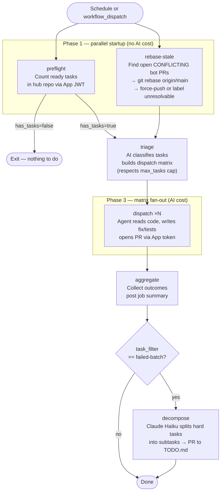
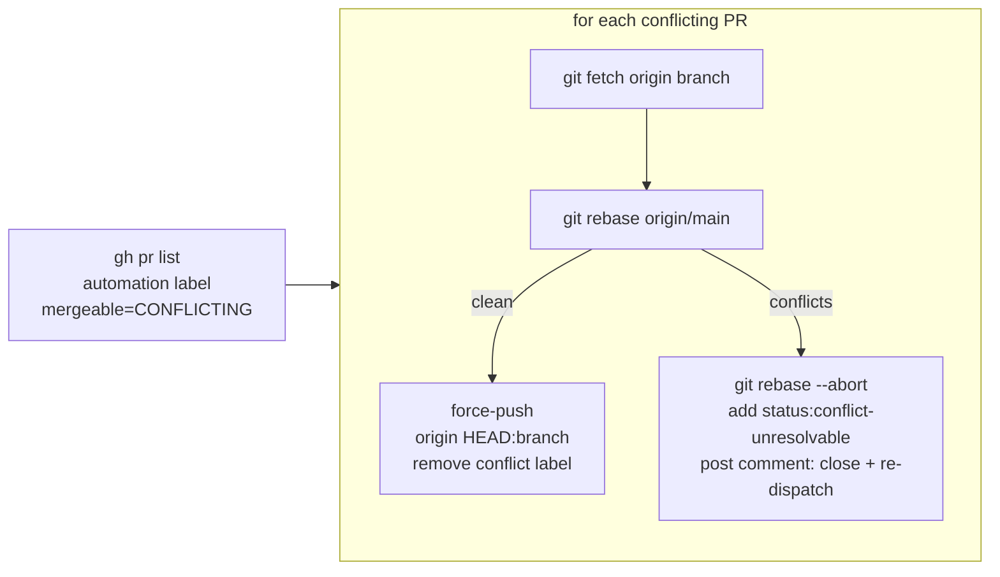

<!-- file: README.md -->
<!-- version: 2.0.0 -->
<!-- guid: 1eaf4c01-aed3-438a-8df9-6904adba092c -->
<!-- last-edited: 2026-06-09 -->

# GitHub Common Workflows

[](https://github.com/falkcorp/github-common/actions/workflows/ci.yml)
[](https://github.com/falkcorp/github-common/actions/workflows/security.yml)

Shared GitHub Actions workflows for all `falkcorp/*` repositories. Call with
`uses:` and pin to a full SHA.

## Reusable Workflows

| Workflow                                                                                           | Purpose                                                                  |
| -------------------------------------------------------------------------------------------------- | ------------------------------------------------------------------------ |
| [`reusable-ci.yml`](.github/workflows/reusable-ci.yml)                                             | Full CI: lint, test, build (Go + Node)                                   |
| [`reusable-ci-minimal.yml`](.github/workflows/reusable-ci-minimal.yml)                             | CI without frontend steps                                                |
| [`reusable-burndown.yml`](.github/workflows/reusable-burndown.yml)                                 | AI agent task dispatch — triage → dispatch matrix → auto-rebase → digest |
| [`reusable-release.yml`](.github/workflows/reusable-release.yml)                                   | Semantic versioning + GitHub release                                     |
| [`reusable-security.yml`](.github/workflows/reusable-security.yml)                                 | CodeQL + Trivy + OSV scanning                                            |
| [`reusable-triage-poll.yml`](.github/workflows/reusable-triage-poll.yml)                           | Poll burndown hub for new ready tasks                                    |
| [`reusable-maintenance.yml`](.github/workflows/reusable-maintenance.yml)                           | Stale issue cleanup, label sync                                          |
| [`reusable-unified-issue-management.yml`](.github/workflows/reusable-unified-issue-management.yml) | JSON-driven issue updates, Copilot tickets, dedup                        |

## 🤖 Burndown Bot (`reusable-burndown.yml`)

Fully automated AI agent dispatch. Each calling repo has a hub repo (GitHub
Issues as task specs). The workflow fans out AI agents to implement tasks and
open PRs — then cleans up any stale conflicting PRs automatically before each
run.

### Full run flow



### Conflict resolution — rebase-stale

When `main` advances past a bot PR's base, GitHub marks it `CONFLICTING`. The
`rebase-stale` job resolves this before every triage:



### Inputs

| Input           | Default                   | Description                                              |
| --------------- | ------------------------- | -------------------------------------------------------- |
| `mode`          | `dry-run`                 | `dry-run` \| `draft-only` \| `full` (auto-merges PRs)    |
| `hub_repo`      | `falkcorp/burndown-tasks` | GitHub repo holding task issues                          |
| `triage_model`  | `o4-mini`                 | OpenAI model for triage                                  |
| `cheapest_only` | `false`                   | Skip model tier escalation                               |
| `max_tasks`     | `0` (unlimited)           | Cap dispatched tasks per run                             |
| `task_filter`   | `""`                      | `""` = normal \| `"failed-batch"` = hard run + decompose |

### Required secrets

`BURNDOWN_BOT_APP_ID`, `BURNDOWN_BOT_INSTALLATION_ID`,
`BURNDOWN_BOT_PRIVATE_KEY`,  
`BURNDOWN_BOT_OPENAI_API_KEY` (or `BURNDOWN_BOT_CLAUDE_API_KEY`)

### Caller example

```yaml
# .github/workflows/nightly-burndown.yml
jobs:
  burndown:
    uses: falkcorp/github-common/.github/workflows/reusable-burndown.yml@<SHA> # vX.Y.Z
    with:
      # Scheduled runs auto-merge; manual dispatch defaults to draft-only for safety
      mode:
        ${{ github.event_name == 'schedule' && 'full' || inputs.mode ||
        'draft-only' }}
      hub_repo: falkcorp/burndown-tasks
      cheapest_only: true
      triage_model: gpt-4.1
      max_tasks:
        ${{ github.event_name == 'schedule' && 8 || fromJSON(inputs.max_tasks ||
        '0') }}
    secrets: inherit
```

> **Always pin to a full commit SHA, never a tag.** Use
> `@<40-char-sha> # vX.Y.Z`.

## Requirements

- GitHub App with `contents:write`, `pull-requests:write`, `issues:write` on
  target repos
- All `uses:` references must be SHA-pinned (enforced by pre-commit hooks)

## See also

- [CHANGELOG.md](CHANGELOG.md) — version history and recent changes
- [TODO.md](TODO.md) — planned work and backlog
- [CONTRIBUTING.md](CONTRIBUTING.md) — development setup and PR guidelines
- [SECURITY.md](SECURITY.md) — vulnerability reporting
