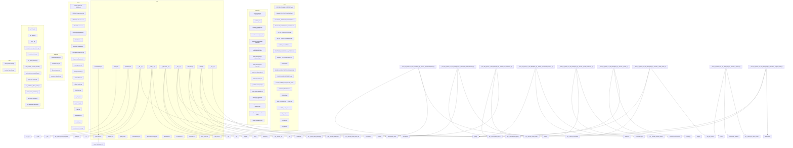

```mermaid
graph TD

  subgraph docs
    docs_DOCKER_CACHING_STRATEGY_md["DOCKER_CACHING_STRATEGY.md"]
    docs_ENHANCED_SCRIPTS_UPDATE_md["ENHANCED_SCRIPTS_UPDATE.md"]
    docs_ENHANCED_WORKFLOW_MIGRATION_md["ENHANCED_WORKFLOW_MIGRATION.md"]
    docs_ENHANCED_WORKFLOW_SUMMARY_md["ENHANCED_WORKFLOW_SUMMARY.md"]
    docs_JSCPD_CONFIGURATION_md["JSCPD_CONFIGURATION.md"]
    docs_LINTER_CONFIG_LOCATIONS_md["LINTER_CONFIG_LOCATIONS.md"]
    docs_LINTER_VALIDATION_md["LINTER_VALIDATION.md"]
    docs_PRETTIER_MARKDOWNLINT_STRATEGY_md["PRETTIER_MARKDOWNLINT_STRATEGY"]
    docs_PROMPT_CATEGORIZATION_md["PROMPT_CATEGORIZATION.md"]
    docs_README_md["README.md"]
    docs_SUPER_LINTER_CONFIG_COMPARISON_md["SUPER_LINTER_CONFIG_COMPARISON"]
    docs_SUPER_LINTER_STRATEGY_md["SUPER_LINTER_STRATEGY.md"]
    docs_SUPER_LINTER_TEST_FAILURE_ANALYSIS_md["SUPER_LINTER_TEST_FAILURE_ANAL"]
    docs_cross_registry_todos_AI_AGENT_BRIEFING_md["AI_AGENT_BRIEFING.md"]
    docs_cross_registry_todos_README_md["README.md"]
    docs_cross_registry_todos_TASK_GENERATION_STATUS_md["TASK_GENERATION_STATUS.md"]
    docs_cross_registry_todos_task_01_fix_yaml_syntax_md["task-01-fix-yaml-syntax.md"]
    docs_cross_registry_todos_task_01_t01_part1_md["t01-part1.md"]
    docs_cross_registry_todos_task_01_t01_part2_md["t01-part2.md"]
    docs_cross_registry_todos_task_01_t01_part3_md["t01-part3.md"]
  end

  subgraph examples
    examples_migration_guides_subtitle_manager_migration_md["subtitle-manager-migration.md"]
    examples_pr_labler_yml["pr-labler.yml"]
    examples_universal_dependency_submission_yml["universal-dependency-submissio"]
    examples_workflows_ai_rebase_example_yml["ai-rebase-example.yml"]
    examples_workflows_enhanced_docs_update_example_yml["enhanced-docs-update-example.y"]
    examples_workflows_enhanced_issue_management_example_yml["enhanced-issue-management-exam"]
    examples_workflows_issue_management_advanced_yml["issue-management-advanced.yml"]
    examples_workflows_issue_management_basic_yml["issue-management-basic.yml"]
    examples_workflows_label_sync_advanced_yml["label-sync-advanced.yml"]
    examples_workflows_label_sync_basic_yml["label-sync-basic.yml"]
    examples_workflows_pr_labeler_example_yml["pr-labeler-example.yml"]
    examples_workflows_super_linter_example_yml["super-linter-example.yml"]
    examples_workflows_super_linter_improved_example_yml["super-linter-improved-example."]
    examples_workflows_unified_automation_complete_yml["unified-automation-complete.ym"]
    examples_workflows_unified_automation_with_intelligent_labeling_yml["unified-automation-with-intell"]
    examples_workflows_unified_automation_yml["unified-automation.yml"]
  end

  subgraph root
    _devcontainer_devcontainer_json["devcontainer.json"]
    _devcontainer_post_create_sh["post-create.sh"]
    _eslintrc_yml[".eslintrc.yml"]
    _golangci_yml[".golangci.yml"]
    _jscpd_json[".jscpd.json"]
    _markdownlint_json[".markdownlint.json"]
    _pre_commit_config_yaml[".pre-commit-config.yaml"]
    _prettierrc_json[".prettierrc.json"]
    _pytest_cache_README_md["README.md"]
    _venv_lib_python3_13_site_packages_pip_24_3_1_dist_info_AUTHORS_txt["AUTHORS.txt"]
    _venv_lib_python3_13_site_packages_pip_24_3_1_dist_info_LICENSE_txt["LICENSE.txt"]
    _venv_lib_python3_13_site_packages_pip_24_3_1_dist_info_entry_points_txt["entry_points.txt"]
    _venv_lib_python3_13_site_packages_pip_24_3_1_dist_info_top_level_txt["top_level.txt"]
    _venv_lib_python3_13_site_packages_pip___init___py["__init__.py"]
    _venv_lib_python3_13_site_packages_pip___main___py["__main__.py"]
    _venv_lib_python3_13_site_packages_pip___pip_runner___py["__pip-runner__.py"]
    _venv_lib_python3_13_site_packages_pip__internal___init___py["__init__.py"]
    _venv_lib_python3_13_site_packages_pip__internal_build_env_py["build_env.py"]
    _venv_lib_python3_13_site_packages_pip__internal_cache_py["cache.py"]
    _venv_lib_python3_13_site_packages_pip__internal_cli___init___py["__init__.py"]
  end

  subgraph scripts
    scripts_CODEX_REBASE_GUIDE_md["CODEX-REBASE-GUIDE.md"]
    scripts_README_cleanup_tool_md["README-cleanup-tool.md"]
    scripts_README_notifications_md["README-notifications.md"]
    scripts_README_rebase_md["README-rebase.md"]
    scripts_README_unified_project_manager_md["README-unified-project-manager"]
    scripts_README_md["README.md"]
    scripts_benchmarks_measure_command_py["measure_command.py"]
    scripts_cleanup_archived_repos_py["cleanup-archived-repos.py"]
    scripts_cleanup_notifications_sh["cleanup-notifications.sh"]
    scripts_cleanup_repos_sh["cleanup-repos.sh"]
    scripts_cleanup_summary_py["cleanup-summary.py"]
    scripts_codex_rebase_sh["codex-rebase.sh"]
    scripts_collect_results_py["collect_results.py"]
    scripts_copilot_firewall_README_md["README.md"]
    scripts_copilot_firewall_copilot_firewall___init___py["__init__.py"]
    scripts_copilot_firewall_copilot_firewall___main___py["__main__.py"]
    scripts_copilot_firewall_copilot_firewall_main_py["main.py"]
    scripts_copilot_firewall_requirements_txt["requirements.txt"]
    scripts_copilot_firewall_test_fix_py["test_fix.py"]
    scripts_create_module_tags_py["create-module-tags.py"]
  end

  subgraph templates
    templates_codeql_advanced_codeql_yml["advanced-codeql.yml"]
    templates_workflows_container_only_yml["container-only.yml"]
    templates_workflows_library_release_yml["library-release.yml"]
    templates_workflows_repository_defaults_yml["repository-defaults.yml"]
  end

  subgraph tests
    tests___init___py["__init__.py"]
    tests_test_basic_py["test_basic.py"]
    tests_workflow_scripts___init___py["__init__.py"]
    tests_workflow_scripts_test_automation_workflow_py["test_automation_workflow.py"]
    tests_workflow_scripts_test_ci_workflow_py["test_ci_workflow.py"]
    tests_workflow_scripts_test_docs_workflow_py["test_docs_workflow.py"]
    tests_workflow_scripts_test_generate_release_summary_py["test_generate_release_summary."]
    tests_workflow_scripts_test_maintenance_workflow_py["test_maintenance_workflow.py"]
    tests_workflow_scripts_test_misc_scripts_py["test_misc_scripts.py"]
    tests_workflow_scripts_test_publish_to_github_packages_py["test_publish_to_github_package"]
    tests_workflow_scripts_test_release_workflow_py["test_release_workflow.py"]
    tests_workflow_scripts_test_sync_receiver_py["test_sync_receiver.py"]
    tests_workflow_scripts_test_workflow_common_py["test_workflow_common.py"]
  end

  subgraph tools
    tools_mass_protobuf_fixer_py["mass-protobuf-fixer.py"]
    tools_protobuf_cycle_fixer_py["protobuf-cycle-fixer.py"]
  end

  _devcontainer_devcontainer_json --> _devcontainer_post_create_sh
  _devcontainer_post_create_sh --> setup_label_sync_sh
  _jscpd_json --> **_*_py
  _prettierrc_json --> *_yaml
  _prettierrc_json --> *_yml
  _venv_lib_python3_13_site_packages_pip___init___py --> pip__internal_utils_entrypoints
  _venv_lib_python3_13_site_packages_pip___init___py --> _wrapper
  _venv_lib_python3_13_site_packages_pip___init___py --> typing
  _venv_lib_python3_13_site_packages_pip___main___py --> os
  _venv_lib_python3_13_site_packages_pip___main___py --> sys
  _venv_lib_python3_13_site_packages_pip___main___py --> pip
  _venv_lib_python3_13_site_packages_pip___pip_runner___py --> os_path
  _venv_lib_python3_13_site_packages_pip___pip_runner___py --> runpy
  _venv_lib_python3_13_site_packages_pip___pip_runner___py --> statement_
  _venv_lib_python3_13_site_packages_pip__internal___init___py --> typing
  _venv_lib_python3_13_site_packages_pip__internal___init___py --> pip__internal_utils
  _venv_lib_python3_13_site_packages_pip__internal___init___py --> of
  _venv_lib_python3_13_site_packages_pip__internal_build_env_py --> pip__internal_utils_logging
  _venv_lib_python3_13_site_packages_pip__internal_build_env_py --> VERBOSE
  _venv_lib_python3_13_site_packages_pip__internal_build_env_py --> pip__internal_utils_packaging
  _venv_lib_python3_13_site_packages_pip__internal_cache_py --> pip__internal_models_link
  _venv_lib_python3_13_site_packages_pip__internal_cache_py --> pip__internal_models_direct_url
  _venv_lib_python3_13_site_packages_pip__internal_cache_py --> canonicalize_name
  _venv_lib_python3_13_site_packages_pip__internal_cli___init___py --> submodules
  _venv_lib_python3_13_site_packages_pip__internal_cli_autocompletion_py --> typing
  _venv_lib_python3_13_site_packages_pip__internal_cli_autocompletion_py --> pip__internal_commands
  _venv_lib_python3_13_site_packages_pip__internal_cli_autocompletion_py --> itertools
  _venv_lib_python3_13_site_packages_pip__internal_cli_base_command_py --> pip__internal_utils_logging
  _venv_lib_python3_13_site_packages_pip__internal_cli_base_command_py --> reconfigure
  _venv_lib_python3_13_site_packages_pip__internal_cli_base_command_py --> Values
  _venv_lib_python3_13_site_packages_pip__internal_cli_cmdoptions_py --> pip__internal_utils_hashes
  _venv_lib_python3_13_site_packages_pip__internal_cli_cmdoptions_py --> pip__internal_models_index
  _venv_lib_python3_13_site_packages_pip__internal_cli_cmdoptions_py --> canonicalize_name
  _venv_lib_python3_13_site_packages_pip__internal_cli_command_context_py --> typing
  _venv_lib_python3_13_site_packages_pip__internal_cli_command_context_py --> ExitStack
  _venv_lib_python3_13_site_packages_pip__internal_cli_command_context_py --> ContextManager
  _venv_lib_python3_13_site_packages_pip__internal_cli_index_command_py --> pip__internal_network_session
  _venv_lib_python3_13_site_packages_pip__internal_cli_index_command_py --> Values
  _venv_lib_python3_13_site_packages_pip__internal_cli_index_command_py --> CommandContextMixIn
  _venv_lib_python3_13_site_packages_pip__internal_cli_main_py --> warnings
  _venv_lib_python3_13_site_packages_pip__internal_cli_main_py --> logging
  _venv_lib_python3_13_site_packages_pip__internal_cli_main_py --> typing
  _venv_lib_python3_13_site_packages_pip__internal_cli_main_parser_py --> typing
  _venv_lib_python3_13_site_packages_pip__internal_cli_main_parser_py --> pip__internal_commands
  _venv_lib_python3_13_site_packages_pip__internal_cli_main_parser_py --> get_pip_version
  _venv_lib_python3_13_site_packages_pip__internal_cli_parser_py --> shutil
  _venv_lib_python3_13_site_packages_pip__internal_cli_parser_py --> UNKNOWN_ERROR
  _venv_lib_python3_13_site_packages_pip__internal_cli_parser_py --> pip__internal_cli_status_codes
  _venv_lib_python3_13_site_packages_pip__internal_cli_progress_bars_py --> pip__internal_utils_logging
  _venv_lib_python3_13_site_packages_pip__internal_cli_progress_bars_py --> typing
  _venv_lib_python3_13_site_packages_pip__internal_cli_progress_bars_py --> RateLimiter
```