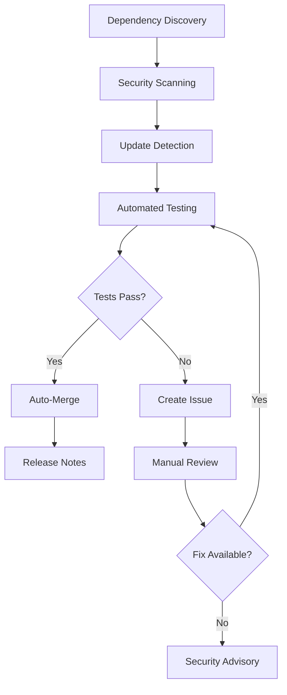

<!-- file: docs/cross-registry-todos/task-12/t12-part1.md -->
<!-- version: 1.0.0 -->
<!-- guid: t12-dependency-management-part1-f8g9h0i1-j2k3 -->

# Task 12: Dependency Management Automation

## Overview and Strategy

### Problem Statement

Modern software projects depend on hundreds or thousands of external dependencies across multiple
ecosystems:

- **Rust**: crates.io dependencies (cargo)
- **Python**: PyPI packages (pip, poetry, pipenv)
- **JavaScript/TypeScript**: npm packages (npm, yarn, pnpm)
- **Go**: Go modules
- **System**: apt, apk, yum packages
- **Container**: Base images, multi-stage dependencies

**Challenges**:

1. **Security Vulnerabilities**: Dependencies may have known CVEs
2. **Outdated Dependencies**: Stale versions lag behind security patches
3. **Breaking Changes**: Major version bumps can break builds
4. **Transitive Dependencies**: Indirect dependencies harder to track
5. **License Compliance**: Incompatible licenses can cause legal issues
6. **Dependency Confusion**: Malicious packages with similar names
7. **Supply Chain Attacks**: Compromised upstream dependencies

### Current State Analysis

**ghcommon Repository**:

- Multiple language dependencies (Python scripts, potential Rust tools)
- GitHub Actions workflow dependencies
- Docker base image dependencies
- No automated dependency updates
- Manual Dependabot configuration exists
- Security scanning via CodeQL only

**ubuntu-autoinstall-agent Repository**:

- Rust dependencies (Cargo.toml)
- System dependencies for cross-compilation
- Docker base images
- Basic Dependabot configuration
- No automated update merging
- No dependency policy enforcement

### Comprehensive Dependency Management Strategy



**Multi-Tier Approach**:

1. **Automated Discovery**
   - Scan all manifest files (Cargo.toml, requirements.txt, package.json, go.mod)
   - Parse Docker base images
   - Detect GitHub Actions dependencies
   - Build dependency graphs

2. **Security-First Scanning**
   - CVE detection (cargo-audit, pip-audit, npm audit, govulncheck)
   - License scanning (cargo-license, license-checker)
   - Supply chain verification (cosign, sigstore)
   - SBOM generation and comparison

3. **Intelligent Update Strategy**
   - Security patches: Auto-merge if tests pass
   - Patch updates: Auto-merge with approval
   - Minor updates: Create PR, require review
   - Major updates: Create issue, manual migration

4. **Continuous Monitoring**
   - Daily security scans
   - Weekly dependency health checks
   - Monthly audit reports
   - Real-time vulnerability alerts

5. **Policy Enforcement**
   - Allowed/blocked license list
   - Maximum dependency age
   - Minimum test coverage for updates
   - Required security audit for new dependencies

### Dependency Health Metrics

**Key Performance Indicators**:

- **Dependency Freshness Score**: Percentage of dependencies on latest stable version
- **Vulnerability Count**: Critical/high/medium/low CVE counts
- **Update Lag Time**: Days between upstream release and adoption
- **Auto-Merge Success Rate**: Percentage of automated updates successful
- **License Compliance Rate**: Percentage of dependencies with approved licenses
- **Supply Chain Verification**: Percentage of dependencies with verified signatures

**Target Metrics**:

- Freshness Score: >80%
- Critical Vulnerabilities: 0
- High Vulnerabilities: <5
- Update Lag Time: <7 days for security patches
- Auto-Merge Success: >70%
- License Compliance: 100%

### Dependency Management Tools Matrix

| Language   | Manifest                         | Scanner                   | Updater              | License         | SBOM         |
| ---------- | -------------------------------- | ------------------------- | -------------------- | --------------- | ------------ |
| Rust       | Cargo.toml                       | cargo-audit, cargo-deny   | Dependabot, Renovate | cargo-license   | cargo-sbom   |
| Python     | requirements.txt, pyproject.toml | pip-audit, safety, bandit | Dependabot, Renovate | pip-licenses    | syft, cdxgen |
| JavaScript | package.json                     | npm audit, Snyk           | Dependabot, Renovate | license-checker | syft, cdxgen |
| Go         | go.mod                           | govulncheck, nancy        | Dependabot, Renovate | go-licenses     | syft, cdxgen |
| Docker     | Dockerfile                       | trivy, grype              | Renovate             | N/A             | syft         |
| Actions    | workflow.yml                     | action-validator          | Dependabot           | N/A             | N/A          |

### Implementation Roadmap

**Phase 1: Foundation (Weeks 1-2)**

- Configure Dependabot for all ecosystems
- Set up automated security scanning workflows
- Create dependency dashboard

**Phase 2: Automation (Weeks 3-4)**

- Implement auto-merge for security patches
- Add intelligent update grouping
- Create policy enforcement rules

**Phase 3: Advanced Features (Weeks 5-6)**

- SBOM generation and tracking
- License compliance automation
- Supply chain verification
- Dependency health scoring

**Phase 4: Optimization (Weeks 7-8)**

- Fine-tune auto-merge rules
- Optimize testing pipeline for updates
- Add predictive dependency analysis
- Create comprehensive documentation

### Risk Assessment

**High Risk**:

- **Critical CVEs**: Immediate security patches required
- **Unmaintained Dependencies**: No upstream updates for 6+ months
- **Restrictive Licenses**: GPL, AGPL in commercial context
- **Dependency Confusion**: Similar names to malicious packages

**Medium Risk**:

- **High CVEs**: Security patches needed soon
- **Major Version Lag**: Multiple major versions behind
- **Transitive Vulnerabilities**: Issues in indirect dependencies
- **Deprecated Packages**: Upstream marked as deprecated

**Low Risk**:

- **Minor Version Lag**: 1-2 versions behind latest
- **Patch Version Lag**: Minor bug fixes available
- **Documentation Updates**: README-only package updates
- **Development Dependencies**: Test/build tool updates

### Success Criteria

**Operational**:

- ✅ All dependency manifests scanned daily
- ✅ Security patches auto-merged within 24 hours
- ✅ Zero critical vulnerabilities >7 days old
- ✅ Dependency dashboard updated automatically
- ✅ License compliance verified on every PR

**Quality**:

- ✅ 100% test pass rate before auto-merge
- ✅ No broken builds from automated updates
- ✅ SBOM generated for every release
- ✅ Supply chain signatures verified

**Process**:

- ✅ Clear escalation path for failed updates
- ✅ Documented dependency policy
- ✅ Contributor guide for adding dependencies
- ✅ Regular dependency health reviews

## Rust Dependency Management

### Comprehensive Cargo Configuration

```toml
# file: .cargo/config.toml
# version: 2.0.0
# guid: cargo-config-dependency-management

[build]
# Use incremental compilation for faster rebuilds
incremental = true

# Use all available CPU cores
jobs = 0

[profile.dev]
# Faster compilation in development
opt-level = 0
debug = true
incremental = true

[profile.release]
# Aggressive optimization for releases
opt-level = 3
lto = "fat"
codegen-units = 1
strip = "symbols"
debug = false

[profile.release-with-debug]
inherits = "release"
strip = "none"
debug = true

# Dependency-specific optimizations
[profile.dev.package."*"]
opt-level = 2  # Optimize dependencies even in dev mode

# Network configuration for cargo registry
[net]
retry = 3
git-fetch-with-cli = true

# Registries
[registries.crates-io]
protocol = "sparse"

# Source replacement for faster builds
[source.crates-io]
replace-with = "sparse-index"

[source.sparse-index]
registry = "sparse+https://index.crates.io/"
```

### Cargo Deny Configuration (Policy Enforcement)

```toml
# file: deny.toml
# version: 1.0.0
# guid: cargo-deny-config

[advisories]
# Deny crates with security vulnerabilities
version = 2
yanked = "deny"

# RUSTSEC database configuration
db-path = "~/.cargo/advisory-db"
db-urls = ["https://github.com/rustsec/advisory-db"]

# Severity threshold for failing the check
severity-threshold = "medium"

[licenses]
# License policy
version = 2
confidence-threshold = 0.9

# Allowed licenses (permissive open source)
allow = [
    "Apache-2.0",
    "MIT",
    "BSD-2-Clause",
    "BSD-3-Clause",
    "ISC",
    "Zlib",
    "Unicode-DFS-2016",
]

# Licenses that require special approval
copyleft = "deny"
allow-osi-fsf-free = "neither"

# Explicitly denied licenses
deny = [
    "GPL-2.0",
    "GPL-3.0",
    "AGPL-3.0",
    "SSPL",
]

# License exceptions for specific crates
[[licenses.clarify]]
name = "ring"
expression = "MIT AND ISC AND OpenSSL"
license-files = [
    { path = "LICENSE", hash = 0xbd0eed23 }
]

[bans]
# Dependency bans
multiple-versions = "warn"
wildcards = "allow"
highlight = "all"

# Skip certain crates from duplicate version check
skip = []

# Skip checking development dependencies
skip-tree = []

# Deny specific crates (known vulnerabilities, unmaintained)
deny = []

[sources]
# Ensure dependencies only come from trusted sources
unknown-registry = "deny"
unknown-git = "deny"
allow-registry = ["https://github.com/rust-lang/crates.io-index"]
allow-git = []
```

### Automated Cargo Audit Workflow

```yaml
# file: .github/workflows/cargo-audit.yml
# version: 1.0.0
# guid: cargo-audit-workflow

name: Cargo Security Audit

on:
  schedule:
    # Run daily at 00:00 UTC
    - cron: '0 0 * * *'
  push:
    paths:
      - 'Cargo.toml'
      - 'Cargo.lock'
  pull_request:
    paths:
      - 'Cargo.toml'
      - 'Cargo.lock'
  workflow_dispatch:

jobs:
  cargo-audit:
    name: Security Audit
    runs-on: ubuntu-latest
    permissions:
      contents: read
      security-events: write
      issues: write

    steps:
      - name: Checkout code
        uses: actions/checkout@v4

      - name: Install Rust toolchain
        uses: dtolnay/rust-toolchain@stable

      - name: Cache cargo registry
        uses: actions/cache@v4
        with:
          path: |
            ~/.cargo/registry/index/
            ~/.cargo/registry/cache/
            ~/.cargo/git/db/
          key: ${{ runner.os }}-cargo-audit-${{ hashFiles('**/Cargo.lock') }}
          restore-keys: |
            ${{ runner.os }}-cargo-audit-

      - name: Install cargo-audit
        run: cargo install cargo-audit --locked

      - name: Update advisory database
        run: cargo audit fetch

      - name: Run cargo audit
        id: audit
        run: |
          cargo audit --json > audit-results.json || true
          cat audit-results.json

      - name: Parse audit results
        id: parse
        run: |
          VULNERABILITIES=$(jq -r '.vulnerabilities.count' audit-results.json)
          WARNINGS=$(jq -r '.warnings | length' audit-results.json)

          echo "vulnerabilities=$VULNERABILITIES" >> $GITHUB_OUTPUT
          echo "warnings=$WARNINGS" >> $GITHUB_OUTPUT

          if [ "$VULNERABILITIES" -gt 0 ]; then
            echo "status=vulnerable" >> $GITHUB_OUTPUT
          elif [ "$WARNINGS" -gt 0 ]; then
            echo "status=warnings" >> $GITHUB_OUTPUT
          else
            echo "status=clean" >> $GITHUB_OUTPUT
          fi

      - name: Generate SARIF report
        if: always()
        run: |
          cargo audit --json | jq '{
            version: "2.1.0",
            "$schema": "https://raw.githubusercontent.com/oasis-tcs/sarif-spec/master/Schemata/sarif-schema-2.1.0.json",
            runs: [{
              tool: {
                driver: {
                  name: "cargo-audit",
                  informationUri: "https://github.com/rustsec/rustsec",
                  version: "latest"
                }
              },
              results: [.vulnerabilities.list[] | {
                ruleId: .advisory.id,
                level: (if .advisory.severity == "critical" then "error"
                       elif .advisory.severity == "high" then "error"
                       elif .advisory.severity == "medium" then "warning"
                       else "note" end),
                message: {
                  text: .advisory.title
                },
                locations: [{
                  physicalLocation: {
                    artifactLocation: {
                      uri: "Cargo.lock"
                    }
                  }
                }],
                properties: {
                  package: .package.name,
                  version: .package.version,
                  patched_versions: (.advisory.patched_versions // "none")
                }
              }]
            }]
          }' > cargo-audit.sarif

      - name: Upload SARIF to GitHub Security
        if: always()
        uses: github/codeql-action/upload-sarif@v3
        with:
          sarif_file: cargo-audit.sarif
          category: cargo-audit

      - name: Create issue for vulnerabilities
        if: steps.parse.outputs.status == 'vulnerable' && github.event_name == 'schedule'
        uses: actions/github-script@v7
        with:
          script: |
            const fs = require('fs');
            const auditResults = JSON.parse(fs.readFileSync('audit-results.json', 'utf8'));

            const vulnerabilities = auditResults.vulnerabilities.list;

            let issueBody = `# Security Vulnerabilities Detected\n\n`;
            issueBody += `**Date**: ${new Date().toISOString()}\n`;
            issueBody += `**Count**: ${vulnerabilities.length} vulnerabilities\n\n`;

            for (const vuln of vulnerabilities) {
              issueBody += `## ${vuln.advisory.id}: ${vuln.advisory.title}\n\n`;
              issueBody += `- **Package**: ${vuln.package.name} v${vuln.package.version}\n`;
              issueBody += `- **Severity**: ${vuln.advisory.severity}\n`;
              issueBody += `- **Description**: ${vuln.advisory.description}\n`;
              issueBody += `- **Patched Versions**: ${vuln.advisory.patched_versions || 'None'}\n`;
              issueBody += `- **URL**: ${vuln.advisory.url}\n\n`;
            }

            await github.rest.issues.create({
              owner: context.repo.owner,
              repo: context.repo.repo,
              title: `[Security] ${vulnerabilities.length} vulnerabilities detected by cargo-audit`,
              body: issueBody,
              labels: ['security', 'dependencies', 'automated']
            });

      - name: Fail on critical/high vulnerabilities
        if: steps.parse.outputs.status == 'vulnerable'
        run: |
          CRITICAL=$(jq -r '[.vulnerabilities.list[] | select(.advisory.severity == "critical")] | length' audit-results.json)
          HIGH=$(jq -r '[.vulnerabilities.list[] | select(.advisory.severity == "high")] | length' audit-results.json)

          if [ "$CRITICAL" -gt 0 ] || [ "$HIGH" -gt 0 ]; then
            echo "::error::Found $CRITICAL critical and $HIGH high severity vulnerabilities"
            exit 1
          fi
```

---

**Part 1 Complete**: Dependency management overview, strategy, risk assessment, Rust dependency
management (cargo-audit, cargo-deny, security workflows). ✅

**Continue to Part 2** for Python dependency management.
