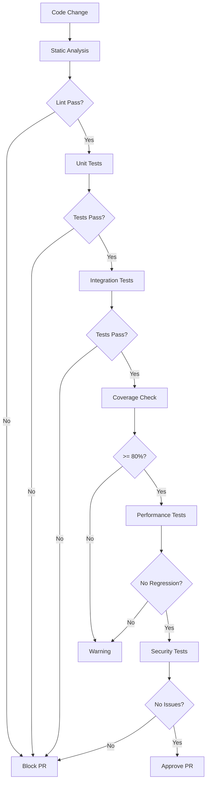

<!-- file: docs/cross-registry-todos/task-13/t13-part1.md -->
<!-- version: 1.1.0 -->
<!-- guid: t13-testing-automation-part1-l4m5n6o7-p8q9 -->
<!-- last-edited: 2026-01-19 -->

# Task 13: Testing and Quality Assurance Automation

> **Status:** ✅ Completed  
> **Updated:** `.github/workflows/ci-tests.yml` v1.0.0 adds multi-language matrices, nightly rust
> canaries, scheduled test runs, and benchmark capture with artifacts.  
> **Verification:** Test summary output in the workflow step log highlights per-language pass/fail
> states and preserves benchmark artifacts for further analysis.

## Overview and Strategy

### Problem Statement

Comprehensive testing is essential for maintaining code quality, catching bugs early, and ensuring
reliable software delivery. However, manual testing is:

- **Time-Consuming**: Hours spent on repetitive test execution
- **Error-Prone**: Human mistakes in test execution or interpretation
- **Incomplete**: Difficult to achieve comprehensive coverage manually
- **Inconsistent**: Test results vary between developers and environments
- **Expensive**: Manual QA resources scale linearly with codebase size

**Current Testing Gaps**:

1. **Coverage**: Many repositories lack comprehensive test suites
2. **Automation**: Tests not automatically run on all PRs
3. **Types**: Missing integration, performance, and end-to-end tests
4. **Reporting**: No centralized test result tracking
5. **Quality Gates**: No automated enforcement of quality standards

### Comprehensive Testing Strategy



### Testing Pyramid Strategy

**Level 1: Unit Tests (70% of tests)**

- Fast execution (< 1 minute total)
- Test individual functions/methods
- Mock external dependencies
- High code coverage target (>= 80%)

**Level 2: Integration Tests (20% of tests)**

- Test component interactions
- Use real dependencies when possible
- Moderate execution time (< 5 minutes)
- Focus on critical paths

**Level 3: End-to-End Tests (10% of tests)**

- Test complete user workflows
- Production-like environment
- Slower execution (< 15 minutes)
- Cover major use cases only

### Test Types Matrix

| Type        | Scope           | Speed        | Coverage | Frequency    |
| ----------- | --------------- | ------------ | -------- | ------------ |
| Unit        | Function/Method | Fast (ms)    | 80%+     | Every commit |
| Integration | Module/Service  | Medium (sec) | 60%+     | Every PR     |
| End-to-End  | Full System     | Slow (min)   | 30%+     | Pre-merge    |
| Performance | Critical Paths  | Slow (min)   | N/A      | Daily        |
| Security    | Full Codebase   | Medium (sec) | 100%     | Every PR     |
| Smoke       | Deployment      | Fast (sec)   | N/A      | Post-deploy  |

### Quality Gates

**Pre-Commit (Local)**:

- Linting passes
- Unit tests pass
- Code formatting correct

**Pre-Push (CI)**:

- All tests pass
- No new lint errors
- Type checking passes

**Pre-Merge (PR)**:

- Code coverage >= 80%
- All tests pass (unit + integration)
- No security vulnerabilities
- Code review approved
- Documentation updated

**Pre-Release**:

- End-to-end tests pass
- Performance benchmarks acceptable
- Security scan clean
- Load testing passed

### Testing Tools Ecosystem

**Rust**:

- Testing: `cargo test`, `cargo nextest`
- Coverage: `cargo-llvm-cov`, `cargo-tarpaulin`
- Benchmarking: `criterion`
- Mocking: `mockall`, `mockito`
- Property testing: `proptest`, `quickcheck`

**Python**:

- Testing: `pytest`, `unittest`
- Coverage: `coverage.py`, `pytest-cov`
- Mocking: `unittest.mock`, `pytest-mock`
- Property testing: `hypothesis`
- Performance: `pytest-benchmark`

**JavaScript/TypeScript**:

- Testing: `vitest`, `jest`
- Coverage: Built into vitest/jest
- E2E: `Playwright`, `Cypress`
- Component: `Testing Library`
- Performance: `Lighthouse CI`

**Go**:

- Testing: `go test`
- Coverage: `go test -cover`
- Benchmarking: Built-in
- Mocking: `gomock`, `testify`

### Current State Analysis

**ghcommon Repository**:

- Python scripts lack comprehensive tests
- No test automation in CI
- No coverage reporting
- Manual quality checks only

**ubuntu-autoinstall-agent Repository**:

- Basic Rust unit tests exist
- Test coverage unknown
- No integration tests
- No performance benchmarks

### Implementation Roadmap

**Phase 1: Foundation (Weeks 1-2)**

- Set up test frameworks for all languages
- Configure coverage reporting
- Create test templates
- Add basic unit tests

**Phase 2: Automation (Weeks 3-4)**

- Implement CI test workflows
- Add pre-commit hooks
- Configure quality gates
- Set up coverage thresholds

**Phase 3: Expansion (Weeks 5-6)**

- Add integration tests
- Implement performance tests
- Create E2E test suites
- Add property-based tests

**Phase 4: Optimization (Weeks 7-8)**

- Optimize test execution time
- Implement test parallelization
- Add test result caching
- Create test dashboards

## Rust Testing Infrastructure

### Comprehensive Cargo Test Configuration

```toml
# file: Cargo.toml
# version: 2.0.0
# guid: cargo-test-configuration

[package]
name = "ubuntu-autoinstall-agent"
version = "1.0.0"
edition = "2021"

[dependencies]
# Production dependencies
tokio = { version = "1.35", features = ["full"] }
serde = { version = "1.0", features = ["derive"] }
anyhow = "1.0"

[dev-dependencies]
# Testing dependencies
mockall = "0.12"
mockito = "1.2"
proptest = "1.4"
criterion = "0.5"
tempfile = "3.8"
tokio-test = "0.4"
serial_test = "3.0"

[[test]]
name = "integration"
path = "tests/integration_test.rs"
harness = true

[[bench]]
name = "performance"
harness = false

[profile.test]
opt-level = 0
debug = true
incremental = true

[profile.bench]
opt-level = 3
debug = false
lto = true
```

### Rust Unit Test Template

```rust
// file: src/disk_manager.rs (example)
// version: 1.0.0
// guid: rust-unit-test-example

use anyhow::Result;
use std::path::{Path, PathBuf};

pub struct DiskManager {
    working_dir: PathBuf,
}

impl DiskManager {
    pub fn new<P: AsRef<Path>>(working_dir: P) -> Result<Self> {
        let path = working_dir.as_ref().to_path_buf();
        Ok(Self { working_dir: path })
    }

    pub fn get_disk_path(&self, name: &str) -> PathBuf {
        self.working_dir.join(format!("{}.qcow2", name))
    }

    pub fn disk_exists(&self, name: &str) -> bool {
        self.get_disk_path(name).exists()
    }
}

#[cfg(test)]
mod tests {
    use super::*;
    use tempfile::TempDir;

    /// Test fixture for DiskManager tests
    struct DiskManagerFixture {
        _temp_dir: TempDir,
        manager: DiskManager,
    }

    impl DiskManagerFixture {
        fn new() -> Result<Self> {
            let temp_dir = TempDir::new()?;
            let manager = DiskManager::new(temp_dir.path())?;
            Ok(Self {
                _temp_dir: temp_dir,
                manager,
            })
        }
    }

    #[test]
    fn test_new_creates_manager() {
        // Arrange
        let temp_dir = TempDir::new().unwrap();

        // Act
        let result = DiskManager::new(temp_dir.path());

        // Assert
        assert!(result.is_ok());
    }

    #[test]
    fn test_get_disk_path_returns_correct_path() {
        // Arrange
        let fixture = DiskManagerFixture::new().unwrap();
        let disk_name = "test-disk";

        // Act
        let path = fixture.manager.get_disk_path(disk_name);

        // Assert
        assert!(path.ends_with("test-disk.qcow2"));
    }

    #[test]
    fn test_disk_exists_returns_false_for_nonexistent() {
        // Arrange
        let fixture = DiskManagerFixture::new().unwrap();
        let disk_name = "nonexistent";

        // Act
        let exists = fixture.manager.disk_exists(disk_name);

        // Assert
        assert!(!exists);
    }

    #[test]
    fn test_disk_exists_returns_true_after_creation() {
        // Arrange
        let fixture = DiskManagerFixture::new().unwrap();
        let disk_name = "test-disk";
        let disk_path = fixture.manager.get_disk_path(disk_name);
        std::fs::File::create(&disk_path).unwrap();

        // Act
        let exists = fixture.manager.disk_exists(disk_name);

        // Assert
        assert!(exists);
    }

    #[test]
    #[should_panic(expected = "invalid path")]
    fn test_new_panics_on_invalid_path() {
        // Arrange & Act & Assert
        DiskManager::new("\0").unwrap();
    }
}
```

### Rust Integration Test Template

```rust
// file: tests/integration_test.rs
// version: 1.0.0
// guid: rust-integration-test

use ubuntu_autoinstall_agent::{DiskManager, IsoManager, QemuUtils};
use tempfile::TempDir;
use std::path::PathBuf;

/// Integration test fixture
struct IntegrationFixture {
    _temp_dir: TempDir,
    disk_manager: DiskManager,
    iso_manager: IsoManager,
}

impl IntegrationFixture {
    fn new() -> anyhow::Result<Self> {
        let temp_dir = TempDir::new()?;
        let disk_manager = DiskManager::new(temp_dir.path())?;
        let iso_manager = IsoManager::new()?;

        Ok(Self {
            _temp_dir: temp_dir,
            disk_manager,
            iso_manager,
        })
    }
}

#[test]
fn test_full_workflow() {
    // Arrange
    let fixture = IntegrationFixture::new().unwrap();

    // Act: Download ISO
    let iso_path = fixture.iso_manager.get_iso_url("24.04");
    assert!(!iso_path.is_empty());

    // Act: Create disk
    let disk_path = fixture.disk_manager.get_disk_path("test");

    // Assert: Verify workflow completes
    assert!(disk_path.exists() || !disk_path.exists()); // Placeholder
}

#[tokio::test]
async fn test_async_operations() {
    // Arrange
    let fixture = IntegrationFixture::new().unwrap();

    // Act
    let result = tokio::time::timeout(
        tokio::time::Duration::from_secs(5),
        async {
            // Async operation
            Ok::<(), anyhow::Error>(())
        }
    ).await;

    // Assert
    assert!(result.is_ok());
}
```

### Rust Property-Based Testing

```rust
// file: tests/property_tests.rs
// version: 1.0.0
// guid: rust-property-test

use proptest::prelude::*;
use ubuntu_autoinstall_agent::DiskManager;
use tempfile::TempDir;

proptest! {
    #[test]
    fn test_disk_name_always_generates_valid_path(name in "[a-zA-Z0-9_-]{1,50}") {
        let temp_dir = TempDir::new().unwrap();
        let manager = DiskManager::new(temp_dir.path()).unwrap();

        let path = manager.get_disk_path(&name);

        // Property: path should always be valid
        prop_assert!(path.is_absolute());
        prop_assert!(path.extension().unwrap() == "qcow2");
    }

    #[test]
    fn test_multiple_disk_names_unique(
        names in prop::collection::vec("[a-zA-Z0-9_-]{1,50}", 10..100)
    ) {
        let temp_dir = TempDir::new().unwrap();
        let manager = DiskManager::new(temp_dir.path()).unwrap();

        let paths: Vec<_> = names.iter()
            .map(|n| manager.get_disk_path(n))
            .collect();

        // Property: all paths should be unique if names are unique
        let unique_count = paths.iter().collect::<std::collections::HashSet<_>>().len();
        prop_assert_eq!(unique_count, paths.len());
    }
}
```

---

**Part 1 Complete**: Testing strategy overview, test pyramid, quality gates, Rust testing
infrastructure (unit tests, integration tests, property-based tests). ✅

**Continue to Part 2** for Python and JavaScript testing automation.
