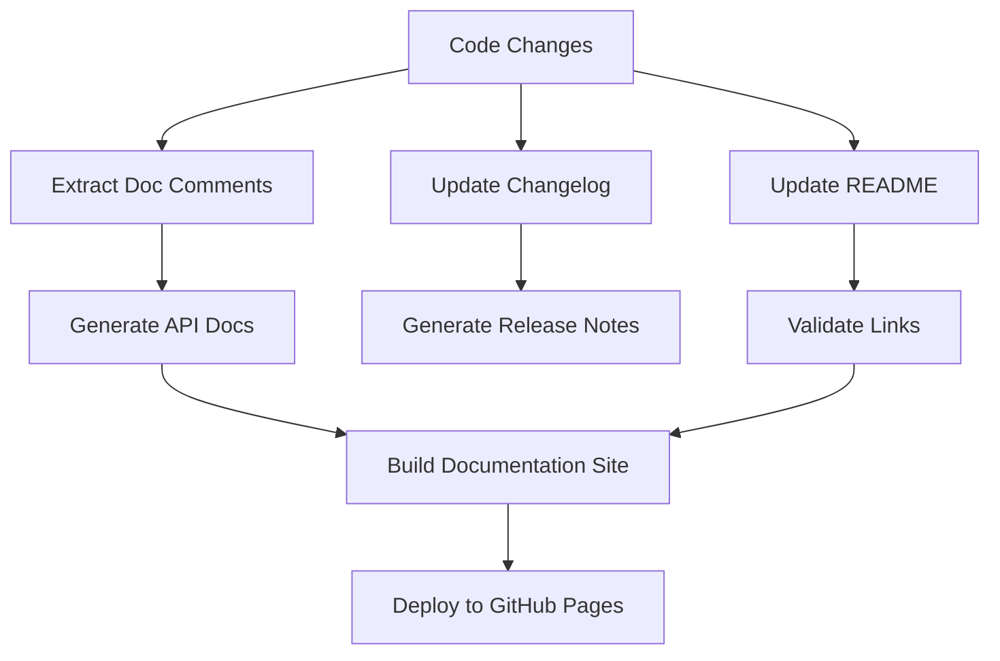

<!-- file: docs/cross-registry-todos/task-14/t14-part1.md -->
<!-- version: 1.1.0 -->
<!-- guid: t14-documentation-automation-part1-r4s5t6u7-v8w9 -->

# Task 14: Documentation Generation and Publishing Automation

> **Status:** ✅ Completed  
> **Updated:** `.github/workflows/documentation.yml` v1.0.0 now auto-builds MkDocs/Sphinx/npm-based
> docs, validates Markdown links, and optionally deploys to GitHub Pages when `DOCS_DEPLOY_TOKEN` is
> present.  
> **Verification:** Documentation builds are uploaded as workflow artifacts for review prior to
> optional publication.

## Overview and Strategy

### Problem Statement

Comprehensive documentation is critical for software projects, but maintaining it manually is:

- **Time-Consuming**: Writing and updating docs for every code change
- **Error-Prone**: Docs drift out of sync with code
- **Inconsistent**: Documentation quality varies across repositories
- **Fragmented**: Docs scattered across README, wiki, comments
- **Outdated**: No automated reminders to update documentation

**Current Documentation Gaps**:

1. **API Documentation**: Missing auto-generated API docs from code
2. **User Guides**: No automated user documentation generation
3. **Architecture Docs**: Manual diagrams and descriptions
4. **Changelog**: Manual changelog maintenance
5. **Publishing**: No automated doc deployment

### Comprehensive Documentation Strategy



### Documentation Types

**API Documentation**

- Auto-generated from code comments
- Language-specific tools (rustdoc, Sphinx, TypeDoc)
- Versioned documentation
- Search functionality

**User Documentation**

- Getting started guides
- Tutorial walkthroughs
- Feature documentation
- Troubleshooting guides

**Developer Documentation**

- Architecture diagrams
- Contributing guidelines
- Code style guides
- Development setup

**Operations Documentation**

- Deployment guides
- Configuration reference
- Monitoring and alerting
- Troubleshooting runbooks

### Documentation Toolchain

**Rust Documentation**

- Tool: `cargo doc`, `mdBook`
- Features: Inline doc tests, cross-references, examples
- Output: Static HTML with search

**Python Documentation**

- Tool: `Sphinx`, `mkdocs`, `pydoc`
- Features: Autodoc, Napoleon docstrings, extensions
- Output: HTML, PDF, ePub

**JavaScript/TypeScript Documentation**

- Tool: `TypeDoc`, `JSDoc`, `Docusaurus`
- Features: Type annotations, React components, MDX
- Output: Interactive website

**Markdown Documentation**

- Tool: `mdBook`, `MkDocs`, `Docusaurus`
- Features: Multi-page docs, theming, plugins
- Output: Static site with search

### Current State Analysis

**ghcommon Repository**:

- Basic README.md
- No automated API docs
- Manual changelog maintenance
- No documentation site
- Scattered instruction files

**ubuntu-autoinstall-agent Repository**:

- README with examples
- Inline Rust doc comments
- No published documentation
- No changelog automation

### Implementation Roadmap

**Phase 1: API Documentation (Weeks 1-2)**

- Set up rustdoc generation
- Configure Sphinx for Python
- Set up TypeDoc for JavaScript
- Automated doc building in CI

**Phase 2: Documentation Sites (Weeks 3-4)**

- Choose site generator (mdBook/MkDocs/Docusaurus)
- Create documentation structure
- Import existing docs
- Set up search functionality

**Phase 3: Automation (Weeks 5-6)**

- Automated changelog generation (git-cliff)
- Release notes from commit history
- README badge automation
- Doc link validation

**Phase 4: Publishing (Weeks 7-8)**

- GitHub Pages deployment
- Versioned documentation
- Custom domain setup
- Analytics integration

## Rust Documentation with rustdoc

### Rustdoc Configuration

```toml
# file: Cargo.toml
# version: 2.1.0
# guid: rustdoc-configuration

[package]
name = "ubuntu-autoinstall-agent"
version = "1.0.0"
edition = "2021"
authors = ["John Falk <john@example.com>"]
description = "Automated Ubuntu installation agent"
documentation = "https://docs.rs/ubuntu-autoinstall-agent"
repository = "https://github.com/jdfalk/ubuntu-autoinstall-agent"
license = "MIT OR Apache-2.0"
readme = "README.md"
keywords = ["ubuntu", "autoinstall", "automation"]
categories = ["command-line-utilities", "development-tools"]

[package.metadata.docs.rs]
# Features to enable when building docs on docs.rs
all-features = true
# Target to build docs for
default-target = "x86_64-unknown-linux-gnu"
# Additional targets to build docs for
targets = ["x86_64-unknown-linux-musl", "aarch64-unknown-linux-gnu"]
# Rustdoc flags
rustdoc-args = ["--cfg", "docsrs"]

[dependencies]
# Production dependencies with doc features
serde = { version = "1.0", features = ["derive"] }
tokio = { version = "1.35", features = ["full"] }

[dev-dependencies]
# Testing dependencies
criterion = "0.5"
```

### Comprehensive Doc Comments

````rust
// file: src/disk_manager.rs
// version: 1.0.0
// guid: rustdoc-example

//! Disk management module for creating and managing virtual disks.
//!
//! This module provides the [`DiskManager`] type for handling virtual disk
//! operations including creation, deletion, and querying disk information.
//!
//! # Examples
//!
//! ```
//! use ubuntu_autoinstall_agent::DiskManager;
//! use std::path::Path;
//!
//! # fn main() -> anyhow::Result<()> {
//! let manager = DiskManager::new(Path::new("/tmp/disks"))?;
//! let disk_path = manager.create_disk("test-disk", 10)?;
//! println!("Created disk at: {:?}", disk_path);
//! # Ok(())
//! # }
//! ```
//!
//! # Architecture
//!
//! The disk manager uses QEMU's `qcow2` format for disk images, providing:
//! - Sparse allocation (disks only use space for actual data)
//! - Snapshot support
//! - Compression
//!
//! # Thread Safety
//!
//! [`DiskManager`] is `Send` and `Sync`, allowing use across threads.

use anyhow::{Context, Result};
use std::path::{Path, PathBuf};
use std::process::Command;

/// Manages virtual disk operations for Ubuntu installations.
///
/// The `DiskManager` handles creating, deleting, and querying virtual disks
/// in qcow2 format. All disks are stored in a configured working directory.
///
/// # Examples
///
/// Basic usage:
///
/// ```
/// # use ubuntu_autoinstall_agent::DiskManager;
/// # use std::path::Path;
/// # fn main() -> anyhow::Result<()> {
/// let manager = DiskManager::new(Path::new("/var/lib/disks"))?;
///
/// // Create a 20GB disk
/// let disk_path = manager.create_disk("ubuntu-server", 20)?;
///
/// // Check if disk exists
/// assert!(manager.disk_exists("ubuntu-server"));
///
/// // Get disk path
/// let path = manager.get_disk_path("ubuntu-server");
/// # Ok(())
/// # }
/// ```
#[derive(Debug, Clone)]
pub struct DiskManager {
    /// Working directory where disks are stored
    working_dir: PathBuf,
}

impl DiskManager {
    /// Creates a new `DiskManager` with the specified working directory.
    ///
    /// # Arguments
    ///
    /// * `working_dir` - Path to directory where disks will be stored
    ///
    /// # Errors
    ///
    /// Returns an error if:
    /// - The working directory doesn't exist
    /// - The process lacks permissions to access the directory
    ///
    /// # Examples
    ///
    /// ```
    /// # use ubuntu_autoinstall_agent::DiskManager;
    /// # use std::path::Path;
    /// # fn main() -> anyhow::Result<()> {
    /// let manager = DiskManager::new(Path::new("/tmp"))?;
    /// # Ok(())
    /// # }
    /// ```
    pub fn new<P: AsRef<Path>>(working_dir: P) -> Result<Self> {
        let path = working_dir.as_ref();

        if !path.exists() {
            anyhow::bail!("Working directory does not exist: {:?}", path);
        }

        Ok(Self {
            working_dir: path.to_path_buf(),
        })
    }

    /// Creates a new virtual disk with the specified name and size.
    ///
    /// This method creates a qcow2 format disk image using `qemu-img`. The disk
    /// uses sparse allocation, so it only consumes space for actual data.
    ///
    /// # Arguments
    ///
    /// * `name` - Name for the disk (used as filename without extension)
    /// * `size_gb` - Size of the disk in gigabytes
    ///
    /// # Returns
    ///
    /// Returns the path to the created disk file.
    ///
    /// # Errors
    ///
    /// Returns an error if:
    /// - `qemu-img` is not installed
    /// - Disk creation fails
    /// - Insufficient disk space
    ///
    /// # Examples
    ///
    /// ```no_run
    /// # use ubuntu_autoinstall_agent::DiskManager;
    /// # use std::path::Path;
    /// # fn main() -> anyhow::Result<()> {
    /// let manager = DiskManager::new(Path::new("/tmp"))?;
    ///
    /// // Create a 50GB disk
    /// let disk_path = manager.create_disk("large-disk", 50)?;
    /// println!("Created disk: {:?}", disk_path);
    /// # Ok(())
    /// # }
    /// ```
    ///
    /// # Performance
    ///
    /// Creating a sparse disk is very fast (< 1 second) regardless of size,
    /// as no actual data is written initially.
    pub fn create_disk(&self, name: &str, size_gb: u64) -> Result<PathBuf> {
        let disk_path = self.get_disk_path(name);

        if disk_path.exists() {
            anyhow::bail!("Disk already exists: {:?}", disk_path);
        }

        let output = Command::new("qemu-img")
            .args([
                "create",
                "-f", "qcow2",
                disk_path.to_str().context("Invalid disk path")?,
                &format!("{}G", size_gb),
            ])
            .output()
            .context("Failed to execute qemu-img")?;

        if !output.status.success() {
            let stderr = String::from_utf8_lossy(&output.stderr);
            anyhow::bail!("qemu-img failed: {}", stderr);
        }

        Ok(disk_path)
    }

    /// Returns the path where a disk with the given name would be stored.
    ///
    /// This method does not check if the disk actually exists. Use
    /// [`disk_exists`](Self::disk_exists) to verify existence.
    ///
    /// # Arguments
    ///
    /// * `name` - Name of the disk
    ///
    /// # Examples
    ///
    /// ```
    /// # use ubuntu_autoinstall_agent::DiskManager;
    /// # use std::path::Path;
    /// # fn main() -> anyhow::Result<()> {
    /// let manager = DiskManager::new(Path::new("/var/lib/disks"))?;
    /// let path = manager.get_disk_path("my-disk");
    /// assert_eq!(path.file_name().unwrap(), "my-disk.qcow2");
    /// # Ok(())
    /// # }
    /// ```
    pub fn get_disk_path(&self, name: &str) -> PathBuf {
        self.working_dir.join(format!("{}.qcow2", name))
    }

    /// Checks if a disk with the given name exists.
    ///
    /// # Arguments
    ///
    /// * `name` - Name of the disk to check
    ///
    /// # Examples
    ///
    /// ```
    /// # use ubuntu_autoinstall_agent::DiskManager;
    /// # use std::path::Path;
    /// # fn main() -> anyhow::Result<()> {
    /// let manager = DiskManager::new(Path::new("/tmp"))?;
    ///
    /// if manager.disk_exists("backup-disk") {
    ///     println!("Backup disk found");
    /// }
    /// # Ok(())
    /// # }
    /// ```
    pub fn disk_exists(&self, name: &str) -> bool {
        self.get_disk_path(name).exists()
    }

    /// Deletes a disk with the given name.
    ///
    /// # Arguments
    ///
    /// * `name` - Name of the disk to delete
    ///
    /// # Errors
    ///
    /// Returns an error if:
    /// - The disk doesn't exist
    /// - The process lacks permissions to delete the file
    ///
    /// # Examples
    ///
    /// ```no_run
    /// # use ubuntu_autoinstall_agent::DiskManager;
    /// # use std::path::Path;
    /// # fn main() -> anyhow::Result<()> {
    /// let manager = DiskManager::new(Path::new("/tmp"))?;
    /// manager.create_disk("temp-disk", 5)?;
    /// manager.delete_disk("temp-disk")?;
    /// # Ok(())
    /// # }
    /// ```
    ///
    /// # Safety
    ///
    /// This operation is irreversible. Ensure you have backups before deleting.
    pub fn delete_disk(&self, name: &str) -> Result<()> {
        let disk_path = self.get_disk_path(name);

        if !disk_path.exists() {
            anyhow::bail!("Disk does not exist: {:?}", disk_path);
        }

        std::fs::remove_file(&disk_path)
            .with_context(|| format!("Failed to delete disk: {:?}", disk_path))?;

        Ok(())
    }
}

// Module-level documentation for private items
mod internal {
    //! Internal implementation details.
    //!
    //! This module contains helper functions not exposed in the public API.
}

#[cfg(test)]
mod tests {
    //! Unit tests for DiskManager.
    //!
    //! Tests use temporary directories to avoid affecting the system.

    use super::*;
    use tempfile::TempDir;

    #[test]
    fn test_new_creates_manager() {
        let temp_dir = TempDir::new().unwrap();
        let result = DiskManager::new(temp_dir.path());
        assert!(result.is_ok());
    }

    // More tests...
}
````

### Building Rustdoc

```bash
#!/bin/bash
# file: scripts/build-docs.sh
# version: 1.0.0
# guid: rustdoc-build-script

set -euo pipefail

echo "Building Rust documentation..."

# Build docs with all features
cargo doc \
    --no-deps \
    --all-features \
    --document-private-items \
    --workspace

# Build docs for docs.rs (with docsrs cfg)
RUSTDOCFLAGS="--cfg docsrs" cargo doc \
    --no-deps \
    --all-features

echo "Documentation built at: target/doc/"
echo "Open with: open target/doc/ubuntu_autoinstall_agent/index.html"
```

---

**Part 1 Complete**: Documentation strategy overview, Rust documentation with comprehensive rustdoc
examples and configuration. ✅

**Continue to Part 2** for Python and JavaScript documentation automation.
