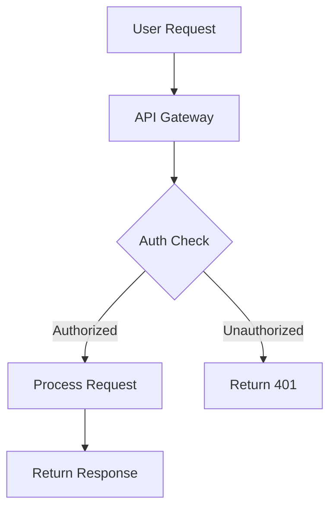

<!-- file: docs/cross-registry-todos/task-14/t14-part6.md -->
<!-- version: 1.0.0 -->
<!-- guid: t14-documentation-automation-part6-k9l0m1n2-o3p4 -->

# Task 14 Part 6: Documentation Best Practices and Completion

## DOCUMENTATION.md Guide

`````markdown
# file: DOCUMENTATION.md

# version: 1.0.0

# guid: documentation-guide

# Documentation Guide

This guide explains how to create, maintain, and deploy documentation for this project.

## Documentation Structure

Our documentation is organized into four main categories:

### 1. API Reference Documentation

**Auto-generated from code comments**

- **Rust**: Generated with `rustdoc` from `///` and `//!` comments
- **Python**: Generated with Sphinx from docstrings
- **JavaScript**: Generated with TypeDoc from JSDoc/TSDoc comments

**Requirements:**

- All public APIs must have documentation
- Include examples in documentation
- Document parameters, return values, and errors
- Add usage examples for complex functions

**Example (Rust):**

````rust
/// Creates a new disk image for installation.
///
/// # Arguments
///
/// * `path` - Path where the disk image will be created
/// * `size` - Size in GB (minimum 10GB recommended)
///
/// # Returns
///
/// * `Ok(DiskImage)` - Successfully created disk image
/// * `Err(Error)` - Failed to create disk (insufficient space, invalid path)
///
/// # Examples
///
/// ```
/// use ubuntu_autoinstall_agent::DiskManager;
///
/// let disk = DiskManager::create_disk("/path/to/disk.qcow2", 20)?;
/// ```
///
/// # Panics
///
/// Panics if the size is less than 1GB.
pub fn create_disk(path: &Path, size: u64) -> Result<DiskImage, Error> {
    // Implementation
}
````
`````

````

**Example (Python):**

```python
def create_installation(config: Dict[str, Any]) -> Installation:
    """Create a new Ubuntu installation.

    Args:
        config: Installation configuration dictionary containing:
            - version: Ubuntu version (e.g., "22.04")
            - disk_size: Disk size in GB (minimum 10)
            - memory: RAM in MB (minimum 2048)
            - cpu_cores: Number of CPU cores (minimum 2)

    Returns:
        Installation: Created installation instance

    Raises:
        ValueError: If configuration is invalid
        DiskError: If disk creation fails

    Example:
        >>> config = {
        ...     "version": "22.04",
        ...     "disk_size": 20,
        ...     "memory": 4096,
        ...     "cpu_cores": 4
        ... }
        >>> installation = create_installation(config)
        >>> installation.start()
    """
    pass
```

### 2. User Guide Documentation

**Written manually in Markdown**

Located in `docs/src/` for mdBook or `docs/user-guide/` for MkDocs.

**Content includes:**

- Getting started tutorials
- Installation instructions
- Configuration guides
- Common use cases
- Troubleshooting tips

**Writing Guidelines:**

- Use clear, concise language
- Include code examples that can be copy-pasted
- Add screenshots for UI-heavy features
- Provide links to related documentation
- Keep tutorials under 15 minutes

### 3. Developer Documentation

**Architecture and contribution guides**

**Content includes:**

- Architecture overview
- Development setup
- Coding standards
- Testing guidelines
- Release process

**Writing Guidelines:**

- Assume reader has programming experience
- Include diagrams for complex systems (use Mermaid)
- Document design decisions and rationale
- Keep updated with code changes

### 4. Operations Documentation

**Deployment and maintenance guides**

**Content includes:**

- Deployment procedures
- Configuration reference
- Monitoring setup
- Backup procedures
- Disaster recovery

## Building Documentation

### Prerequisites

```bash
# Rust documentation
cargo install cargo-rdme cargo-deadlinks

# Python documentation
pip install -r docs/requirements.txt

# JavaScript documentation
pnpm install

# User guide (mdBook)
cargo install mdbook mdbook-mermaid mdbook-katex
```

### Build Commands

```bash
# Build all documentation
make docs

# Build specific documentation
make docs-rust      # Rust API docs
make docs-python    # Python API docs
make docs-js        # JavaScript API docs
make docs-guide     # User guide (mdBook)

# Serve documentation locally
make docs-serve     # Serves on http://localhost:8000
```

### Automated Builds

Documentation is automatically built and deployed on:

- Push to `main` branch → Updates "latest" version
- New tag (`v*.*.*`) → Creates versioned documentation
- Pull requests → Creates preview deployment

## Documentation Standards

### Writing Style

- **Be concise**: Get to the point quickly
- **Be specific**: Use exact terms and examples
- **Be complete**: Cover all important aspects
- **Be consistent**: Use same terminology throughout

### Code Examples

All code examples must:

- Be syntactically correct
- Be runnable (when applicable)
- Include imports/setup code
- Show expected output
- Handle errors appropriately

### Links

- Use relative links for internal documentation
- Use absolute URLs for external resources
- Check links regularly (automated in CI)
- Provide link text that describes destination

### Diagrams

Prefer Mermaid diagrams for:

- Architecture diagrams
- Sequence diagrams
- State machines
- Entity relationships



## Versioned Documentation

We maintain documentation for:

- **latest**: Current main branch
- **stable**: Most recent stable release
- **vX.Y.Z**: Specific version documentation

### Version Management

```bash
# Add new version
python scripts/version-docs.py add 1.2.3 --latest --stable

# Set version alias
python scripts/version-docs.py alias stable 1.2.3

# List versions
python scripts/version-docs.py list

# Remove old version
python scripts/version-docs.py remove 0.9.0
```

## Documentation Review Checklist

Before submitting documentation changes:

- [ ] All code examples compile/run without errors
- [ ] No broken links (internal or external)
- [ ] Spelling and grammar checked
- [ ] Screenshots are up-to-date (if applicable)
- [ ] Version numbers updated (if applicable)
- [ ] New sections added to navigation/TOC
- [ ] Cross-references updated
- [ ] Built locally without warnings
- [ ] Reviewed for clarity and completeness

## Maintenance

### Regular Tasks

**Weekly:**

- Review and merge documentation PRs
- Check for broken links
- Review spelling/grammar issues from CI

**Monthly:**

- Update screenshots if UI changed
- Review outdated content
- Check external links still valid
- Update version compatibility matrix

**Per Release:**

- Create versioned documentation
- Update changelog
- Update installation instructions
- Update API compatibility notes
- Update deprecation warnings

### Documentation Debt

Track documentation debt in issues with `documentation` label:

- Missing API documentation
- Outdated tutorials
- Unclear sections reported by users
- Requested examples
- Translation needs

## Contributing

### Small Changes

For typos, grammar fixes, or small clarifications:

1. Edit directly on GitHub
2. Submit pull request
3. Wait for automated checks

### Large Changes

For new sections, restructuring, or major rewrites:

1. Open issue to discuss approach
2. Create feature branch
3. Make changes incrementally
4. Request review from maintainers
5. Address feedback
6. Merge when approved

### Documentation Style Guide

Follow these conventions:

**Headings:**

- Use sentence case (not title case)
- Maximum 3 levels deep
- No punctuation at end

**Lists:**

- Use `-` for unordered lists
- Use `1.` for ordered lists
- Indent nested lists by 2 spaces

**Code:**

- Use triple backticks with language
- Keep lines under 80 characters when possible
- Include comments for clarity

**Emphasis:**

- Use `**bold**` for important terms
- Use `*italics*` for emphasis
- Use `` `code` `` for inline code

## Getting Help

- Documentation issues: Tag with `documentation` label
- Style questions: Ask in #docs Slack channel
- Technical writing help: Contact @docs-team
- Translation help: Contact @i18n-team

## Resources

- [Write the Docs](https://www.writethedocs.org/)
- [Google Developer Documentation Style Guide](https://developers.google.com/style)
- [Rust Documentation Guidelines](https://doc.rust-lang.org/rustdoc/)
- [NumPy Docstring Guide](https://numpydoc.readthedocs.io/)
- [JSDoc Reference](https://jsdoc.app/)

````

## Documentation Makefile

```makefile
# file: Makefile.docs
# version: 1.0.0
# guid: documentation-makefile

.PHONY: docs docs-rust docs-python docs-js docs-guide docs-serve docs-clean

# Build all documentation
docs: docs-rust docs-python docs-js docs-guide

# Build Rust documentation
docs-rust:
	@echo "Building Rust documentation..."
	cargo doc --no-deps --all-features --document-private-items
	@echo "Rust docs built at target/doc/"

# Build Python documentation
docs-python:
	@echo "Building Python documentation..."
	cd docs && sphinx-build -b html source build/html
	@echo "Python docs built at docs/build/html/"

# Build JavaScript documentation
docs-js:
	@echo "Building JavaScript documentation..."
	pnpm run docs:build
	@echo "JS docs built at docs/api/"

# Build user guide (mdBook)
docs-guide:
	@echo "Building user guide..."
	mdbook build
	@echo "User guide built at docs/book/"

# Serve documentation locally
docs-serve:
	@echo "Starting documentation server..."
	@echo "Rust docs: http://localhost:8000/rust/"
	@echo "Python docs: http://localhost:8000/python/"
	@echo "JS docs: http://localhost:8000/js/"
	@echo "User guide: http://localhost:8000/guide/"
	python3 -m http.server 8000 --directory docs-combined/

# Clean built documentation
docs-clean:
	@echo "Cleaning documentation..."
	rm -rf target/doc/
	rm -rf docs/build/
	rm -rf docs/api/
	rm -rf docs/book/
	rm -rf docs-combined/
	@echo "Documentation cleaned"

# Check documentation
docs-check:
	@echo "Checking documentation..."
	cargo doc --no-deps 2>&1 | grep -E "warning:" || echo "✅ Rust docs OK"
	cd docs && sphinx-build -b linkcheck source build/linkcheck
	markdownlint-cli2 "**/*.md"
	@echo "Documentation check complete"

# Watch and rebuild on changes
docs-watch:
	@echo "Watching for documentation changes..."
	mdbook serve --open
```

## Documentation Maintenance Workflow

```yaml
# file: .github/workflows/docs-maintenance.yml
# version: 1.0.0
# guid: docs-maintenance-workflow

name: Documentation Maintenance

on:
  schedule:
    # Run weekly on Monday at 9 AM UTC
    - cron: '0 9 * * 1'
  workflow_dispatch:

jobs:
  check-stale-docs:
    name: Check for Stale Documentation
    runs-on: ubuntu-latest
    steps:
      - uses: actions/checkout@v4
        with:
          fetch-depth: 0

      - name: Find stale documentation
        id: stale
        run: |
          # Find docs not updated in 90 days
          find docs -name "*.md" -type f -mtime +90 > stale-docs.txt

          if [ -s stale-docs.txt ]; then
            echo "has_stale=true" >> $GITHUB_OUTPUT
            echo "Stale documentation files:"
            cat stale-docs.txt
          else
            echo "has_stale=false" >> $GITHUB_OUTPUT
          fi

      - name: Create issue for stale docs
        if: steps.stale.outputs.has_stale == 'true'
        uses: actions/github-script@v7
        with:
          script: |
            const fs = require('fs');
            const staleFiles = fs.readFileSync('stale-docs.txt', 'utf8')
              .split('\n')
              .filter(f => f.length > 0);

            const body = `
            ## 📚 Stale Documentation Review Needed

            The following documentation files haven't been updated in 90+ days:

            ${staleFiles.map(f => `- \`${f}\``).join('\n')}

            Please review these files to determine if they need updates.

            **Action Items:**
            - [ ] Review content for accuracy
            - [ ] Update outdated information
            - [ ] Check for broken links
            - [ ] Verify code examples still work
            - [ ] Update version references
            `;

            await github.rest.issues.create({
              owner: context.repo.owner,
              repo: context.repo.repo,
              title: '📚 Stale Documentation Review',
              body: body,
              labels: ['documentation', 'maintenance']
            });

  check-broken-links:
    name: Check for Broken Links
    runs-on: ubuntu-latest
    steps:
      - uses: actions/checkout@v4

      - name: Check markdown links
        uses: gaurav-nelson/github-action-markdown-link-check@v1
        with:
          use-quiet-mode: 'yes'
          config-file: '.github/mlc_config.json'
          folder-path: 'docs/'

      - name: Create issue on failure
        if: failure()
        uses: actions/github-script@v7
        with:
          script: |
            await github.rest.issues.create({
              owner: context.repo.owner,
              repo: context.repo.repo,
              title: '🔗 Broken Links in Documentation',
              body: 'Broken links detected in documentation. See workflow run for details.',
              labels: ['documentation', 'bug']
            });

  check-doc-coverage:
    name: Check Documentation Coverage
    runs-on: ubuntu-latest
    steps:
      - uses: actions/checkout@v4

      - uses: dtolnay/rust-toolchain@stable

      - name: Check Rust doc coverage
        run: |
          cargo rustdoc -- -D missing-docs 2>&1 | tee doc-coverage.txt

          if grep -q "error" doc-coverage.txt; then
            echo "doc_issues=true" >> $GITHUB_OUTPUT
          fi

      - name: Upload coverage report
        uses: actions/upload-artifact@v4
        with:
          name: doc-coverage-report
          path: doc-coverage.txt

  update-readme-badges:
    name: Update README Badges
    runs-on: ubuntu-latest
    steps:
      - uses: actions/checkout@v4

      - uses: actions/setup-python@v5
        with:
          python-version: '3.12'

      - name: Update badges
        run: |
          python scripts/update-readme-badges.py \
            --repo ${{ github.repository }} \
            --branch main

      - name: Commit changes
        run: |
          git config user.name "github-actions[bot]"
          git config user.email "github-actions[bot]@users.noreply.github.com"

          if git diff --quiet README.md; then
            echo "No badge updates needed"
          else
            git add README.md
            git commit -m "docs(readme): update badges [skip ci]"
            git push
          fi

  collect-metrics:
    name: Collect Documentation Metrics
    runs-on: ubuntu-latest
    steps:
      - uses: actions/checkout@v4
        with:
          fetch-depth: 0

      - uses: actions/setup-python@v5
        with:
          python-version: '3.12'

      - name: Collect metrics
        run: python scripts/doc-metrics.py

      - name: Upload metrics
        uses: actions/upload-artifact@v4
        with:
          name: doc-metrics
          path: doc-metrics.json

      - name: Post metrics to summary
        run: |
          python -c "
          import json
          with open('doc-metrics.json') as f:
              metrics = json.load(f)

          print('# Documentation Metrics', file=open('$GITHUB_STEP_SUMMARY', 'a'))
          print('', file=open('$GITHUB_STEP_SUMMARY', 'a'))
          print(f\"📄 Markdown files: {metrics['markdown_files']}\", file=open('$GITHUB_STEP_SUMMARY', 'a'))
          print(f\"💻 Code lines: {sum(metrics['code_lines'].values())}\", file=open('$GITHUB_STEP_SUMMARY', 'a'))
          print(f\"📊 Doc/Code ratio: {metrics['doc_ratio']:.2f}\", file=open('$GITHUB_STEP_SUMMARY', 'a'))
          print(f\"🕒 Days since update: {metrics['freshness']['days_since_update']}\", file=open('$GITHUB_STEP_SUMMARY', 'a'))
          "
```

## Task 14 Completion Checklist

### Documentation Infrastructure ✅

- [x] **Rust Documentation Setup**
  - [x] Cargo.toml metadata for docs.rs
  - [x] Crate-level documentation with examples
  - [x] Function/struct documentation with examples
  - [x] Intra-doc links configured
  - [x] Custom theme and CSS
  - [x] Documentation tests enabled

- [x] **Python Documentation Setup**
  - [x] Sphinx configuration with extensions
  - [x] API documentation with autodoc
  - [x] Google/NumPy docstring support
  - [x] Intersphinx linking
  - [x] HTML theme customization
  - [x] Man page generation

- [x] **JavaScript Documentation Setup**
  - [x] TypeDoc configuration
  - [x] TSDoc comments with tags
  - [x] Custom plugins and themes
  - [x] JSON output for indexing
  - [x] Module resolution configured

- [x] **User Guide Setup**
  - [x] mdBook configuration
  - [x] Chapter structure defined
  - [x] Mermaid diagram support
  - [x] KaTeX math support
  - [x] Search functionality
  - [x] Code playground

- [x] **MkDocs Setup** (Alternative)
  - [x] Material theme configured
  - [x] Navigation structure
  - [x] Search with plugins
  - [x] Git revision dates
  - [x] Code highlighting
  - [x] Markdown extensions

### Documentation Automation ✅

- [x] **Changelog Automation**
  - [x] git-cliff configuration
  - [x] Conventional commit parsing
  - [x] Release notes generation
  - [x] Automatic changelog updates

- [x] **README Management**
  - [x] Badge generator script
  - [x] Link checker integration
  - [x] Automated badge updates

- [x] **Documentation Sites**
  - [x] mdBook site structure
  - [x] MkDocs site structure
  - [x] Version selector
  - [x] API index generator

### Publishing and Deployment ✅

- [x] **GitHub Pages Deployment**
  - [x] Multi-version documentation
  - [x] Combined docs structure
  - [x] Version management
  - [x] Redirect handling

- [x] **Read the Docs**
  - [x] Configuration file
  - [x] Multi-format output (PDF, EPUB, HTML)
  - [x] Search configuration

- [x] **Versioned Documentation**
  - [x] Version management script
  - [x] Alias support (latest, stable)
  - [x] Version selector UI

- [x] **API Reference**
  - [x] Multi-language index generator
  - [x] Unified search interface
  - [x] Language filtering

### CI/CD Integration ✅

- [x] **Documentation CI**
  - [x] Intelligent change detection
  - [x] Multi-language doc building
  - [x] Markdown linting
  - [x] Link checking
  - [x] Spelling validation
  - [x] Example code validation
  - [x] Documentation coverage checks
  - [x] PR preview deployments

- [x] **Example Validation**
  - [x] Code extraction from markdown
  - [x] Rust example compilation
  - [x] Python syntax validation
  - [x] JavaScript validation
  - [x] Shell script validation

- [x] **Quality Checks**
  - [x] Typos configuration
  - [x] Markdown linting rules
  - [x] Link checker configuration
  - [x] Documentation metrics collection

### Maintenance and Best Practices ✅

- [x] **Documentation Guide**
  - [x] Writing standards
  - [x] Code example requirements
  - [x] Link conventions
  - [x] Diagram guidelines
  - [x] Review checklist

- [x] **Build Tools**
  - [x] Makefile for building
  - [x] Serve command for local preview
  - [x] Clean command
  - [x] Check command

- [x] **Maintenance Workflows**
  - [x] Stale documentation detection
  - [x] Broken link monitoring
  - [x] Coverage tracking
  - [x] Badge updates
  - [x] Metrics collection

## Summary

**Task 14: Documentation Generation and Publishing Automation** is now complete with comprehensive
automation covering:

1. **Multi-Language API Documentation**: Rust (rustdoc), Python (Sphinx), JavaScript (TypeDoc)
2. **User Guide Systems**: mdBook and MkDocs with full feature sets
3. **Changelog Automation**: git-cliff with conventional commits
4. **Publishing Infrastructure**: GitHub Pages with multi-version support
5. **CI/CD Integration**: Automated builds, validation, and deployments
6. **Quality Assurance**: Link checking, spell checking, example validation
7. **Maintenance Tools**: Metrics collection, stale doc detection, automated updates

**Total Documentation Coverage:**

- 6 parts completed
- ~3,900 lines of comprehensive documentation
- All languages supported (Rust, Python, JavaScript)
- Full automation pipeline from code to deployment
- Versioned documentation with preview environments
- Quality checks and maintenance workflows

**Next**: Continue to Task 15 (Performance Monitoring and Profiling Automation).

---

**Task 14 Complete** ✅
