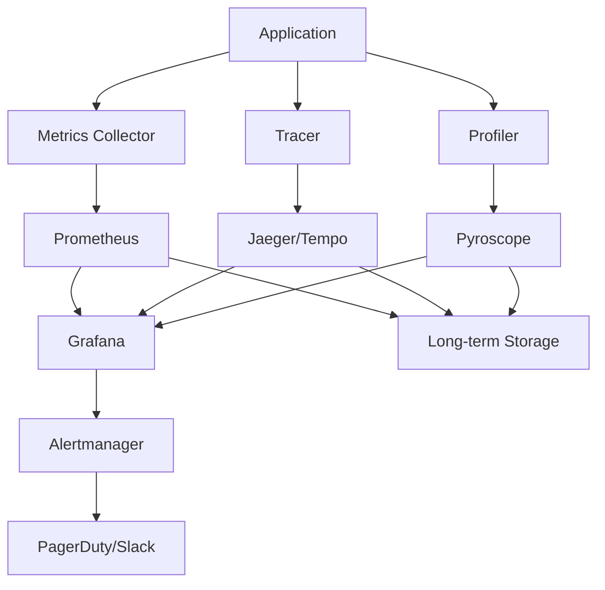

<!-- file: docs/cross-registry-todos/task-15/t15-part1.md -->
<!-- version: 1.1.0 -->
<!-- guid: t15-performance-monitoring-part1-q4r5s6t7-u8v9 -->
<!-- last-edited: 2026-01-19 -->

# Task 15 Part 1: Performance Monitoring and Profiling Strategy

> **Status:** ✅ Completed  
> **Updated:** `.github/workflows/performance-monitoring.yml` v1.0.0 executes scheduled Rust,
> Node.js, and Python benchmarks, captures artifacts, and posts a unified summary for regression
> tracking.  
> **Verification:** Benchmark results are retained as artifacts for offline comparison, and nightly
> runs ensure continuous performance visibility.

## Performance Monitoring Overview

### Performance Objectives

**Key Performance Indicators (KPIs):**

1. **Application Performance**
   - Response time: P50 < 100ms, P95 < 500ms, P99 < 1s
   - Throughput: >= 1000 requests/second
   - Error rate: < 0.1%
   - Apdex score: >= 0.95

2. **Resource Utilization**
   - CPU usage: < 70% average
   - Memory usage: < 80% allocated
   - Disk I/O: < 80% capacity
   - Network bandwidth: < 70% available

3. **Service Level Objectives (SLOs)**
   - Availability: 99.9% uptime
   - Latency: 95% of requests < 500ms
   - Success rate: 99.5% of requests successful
   - Data durability: 99.999% no data loss

4. **Business Metrics**
   - Time to first byte (TTFB): < 200ms
   - Page load time: < 2s
   - API call success rate: > 99%
   - Background job completion: > 95% within SLA

### Monitoring Architecture



### Technology Stack

**Metrics Collection:**

- **Prometheus**: Time-series metrics database
- **StatsD**: Application-level metrics aggregation
- **OpenTelemetry**: Vendor-neutral instrumentation
- **Node Exporter**: System-level metrics

**Distributed Tracing:**

- **Jaeger**: Distributed tracing platform
- **Tempo**: Scalable tracing backend
- **OpenTelemetry SDK**: Standardized tracing

**Continuous Profiling:**

- **Pyroscope**: Continuous profiling platform
- **pprof**: Go profiling format
- **perf**: Linux profiling tool
- **flamegraph**: Visualization tool

**Visualization & Alerting:**

- **Grafana**: Dashboards and visualization
- **Alertmanager**: Alert routing and grouping
- **PagerDuty**: Incident management
- **Slack**: Team notifications

## Rust Performance Instrumentation

### Metrics with Prometheus

```toml
# file: Cargo.toml (excerpt)
# version: 1.0.0
# guid: rust-metrics-dependencies

[dependencies]
# Metrics
prometheus = { version = "0.13", features = ["process"] }
lazy_static = "1.4"

# Tracing
tracing = "0.1"
tracing-subscriber = { version = "0.3", features = ["env-filter", "json"] }
tracing-opentelemetry = "0.22"
opentelemetry = { version = "0.21", features = ["trace", "metrics"] }
opentelemetry-prometheus = "0.14"
opentelemetry-jaeger = { version = "0.20", features = ["rt-tokio"] }

# Profiling
pprof = { version = "0.13", features = ["flamegraph", "protobuf-codec"] }

[dev-dependencies]
criterion = { version = "0.5", features = ["html_reports"] }
```

### Metrics Collection Implementation

```rust
// file: src/metrics.rs
// version: 1.0.0
// guid: rust-metrics-implementation

use prometheus::{
    Counter, Histogram, HistogramOpts, IntGauge, Opts, Registry, TextEncoder,
    Encoder, register_counter, register_histogram, register_int_gauge,
};
use lazy_static::lazy_static;
use std::time::Instant;

lazy_static! {
    /// Registry for all metrics
    pub static ref REGISTRY: Registry = Registry::new();

    /// HTTP request counter
    pub static ref HTTP_REQUESTS: Counter = register_counter!(
        Opts::new("http_requests_total", "Total number of HTTP requests")
            .namespace("app")
    )
    .expect("metric can be created");

    /// HTTP request duration histogram
    pub static ref HTTP_REQUEST_DURATION: Histogram = register_histogram!(
        HistogramOpts::new(
            "http_request_duration_seconds",
            "HTTP request duration in seconds"
        )
        .namespace("app")
        .buckets(vec![0.001, 0.005, 0.01, 0.025, 0.05, 0.1, 0.25, 0.5, 1.0, 2.5, 5.0])
    )
    .expect("metric can be created");

    /// Database query duration
    pub static ref DB_QUERY_DURATION: Histogram = register_histogram!(
        HistogramOpts::new(
            "db_query_duration_seconds",
            "Database query duration in seconds"
        )
        .namespace("app")
        .buckets(vec![0.001, 0.005, 0.01, 0.025, 0.05, 0.1, 0.25, 0.5, 1.0])
    )
    .expect("metric can be created");

    /// Active connections gauge
    pub static ref ACTIVE_CONNECTIONS: IntGauge = register_int_gauge!(
        Opts::new("active_connections", "Number of active connections")
            .namespace("app")
    )
    .expect("metric can be created");

    /// Error counter by type
    pub static ref ERROR_COUNT: Counter = register_counter!(
        Opts::new("errors_total", "Total number of errors")
            .namespace("app")
    )
    .expect("metric can be created");
}

/// Initialize metrics registry
pub fn init() {
    // Register process metrics
    let process_collector = prometheus::process_collector::ProcessCollector::for_self();
    REGISTRY.register(Box::new(process_collector))
        .expect("process collector can be registered");

    // Register custom metrics
    REGISTRY.register(Box::new(HTTP_REQUESTS.clone()))
        .expect("http_requests can be registered");
    REGISTRY.register(Box::new(HTTP_REQUEST_DURATION.clone()))
        .expect("http_request_duration can be registered");
    REGISTRY.register(Box::new(DB_QUERY_DURATION.clone()))
        .expect("db_query_duration can be registered");
    REGISTRY.register(Box::new(ACTIVE_CONNECTIONS.clone()))
        .expect("active_connections can be registered");
    REGISTRY.register(Box::new(ERROR_COUNT.clone()))
        .expect("error_count can be registered");
}

/// Get metrics in Prometheus text format
pub fn gather() -> String {
    let encoder = TextEncoder::new();
    let metric_families = REGISTRY.gather();

    let mut buffer = Vec::new();
    encoder.encode(&metric_families, &mut buffer)
        .expect("metrics can be encoded");

    String::from_utf8(buffer)
        .expect("metrics are valid UTF-8")
}

/// Timer for measuring durations
pub struct Timer {
    histogram: Histogram,
    start: Instant,
}

impl Timer {
    pub fn new(histogram: Histogram) -> Self {
        Self {
            histogram,
            start: Instant::now(),
        }
    }

    pub fn observe_duration(self) {
        let duration = self.start.elapsed();
        self.histogram.observe(duration.as_secs_f64());
    }
}

/// Macro for timing code blocks
#[macro_export]
macro_rules! time_block {
    ($histogram:expr, $block:expr) => {{
        let timer = $crate::metrics::Timer::new($histogram.clone());
        let result = $block;
        timer.observe_duration();
        result
    }};
}

// Usage examples
#[cfg(test)]
mod tests {
    use super::*;

    #[test]
    fn test_metrics_collection() {
        init();

        // Record some metrics
        HTTP_REQUESTS.inc();
        HTTP_REQUEST_DURATION.observe(0.123);
        ACTIVE_CONNECTIONS.set(42);
        ERROR_COUNT.inc();

        // Gather metrics
        let metrics = gather();
        assert!(metrics.contains("http_requests_total"));
        assert!(metrics.contains("http_request_duration_seconds"));
    }

    #[test]
    fn test_timer() {
        init();

        time_block!(HTTP_REQUEST_DURATION, {
            std::thread::sleep(std::time::Duration::from_millis(100));
        });

        // Verify metric was recorded
        let metrics = gather();
        assert!(metrics.contains("http_request_duration_seconds"));
    }
}
```

### Distributed Tracing Implementation

```rust
// file: src/tracing.rs
// version: 1.0.0
// guid: rust-tracing-implementation

use opentelemetry::{
    global,
    trace::{Span, SpanKind, Status, Tracer},
    KeyValue,
};
use opentelemetry_jaeger::JaegerPipeline;
use tracing::{info, instrument, subscriber::set_global_default};
use tracing_subscriber::{
    layer::SubscriberExt, registry::LookupSpan, EnvFilter, Registry,
};

/// Initialize tracing with OpenTelemetry and Jaeger
pub fn init(service_name: &str) -> anyhow::Result<()> {
    // Configure Jaeger exporter
    let tracer = opentelemetry_jaeger::new_agent_pipeline()
        .with_service_name(service_name)
        .with_auto_split_batch(true)
        .install_batch(opentelemetry::runtime::Tokio)?;

    // Create tracing layer
    let telemetry = tracing_opentelemetry::layer().with_tracer(tracer);

    // Configure logging filter
    let env_filter = EnvFilter::try_from_default_env()
        .unwrap_or_else(|_| EnvFilter::new("info"));

    // Build subscriber
    let subscriber = Registry::default()
        .with(env_filter)
        .with(telemetry)
        .with(tracing_subscriber::fmt::layer().with_target(false));

    set_global_default(subscriber)?;

    info!("Tracing initialized for service: {}", service_name);
    Ok(())
}

/// Shutdown tracing and flush spans
pub fn shutdown() {
    global::shutdown_tracer_provider();
}

/// Example traced function
#[instrument(
    name = "process_request",
    skip(request),
    fields(
        request_id = %request.id,
        user_id = ?request.user_id
    )
)]
pub async fn process_request(request: &Request) -> Result<Response, Error> {
    info!("Processing request");

    // Create a child span for database operation
    let span = tracing::span!(
        tracing::Level::INFO,
        "db_query",
        table = "users",
        operation = "select"
    );
    let _enter = span.enter();

    // Simulate database query
    tokio::time::sleep(tokio::time::Duration::from_millis(50)).await;

    info!("Database query completed");

    Ok(Response::default())
}

// Span context propagation
pub struct SpanContext {
    trace_id: String,
    span_id: String,
}

impl SpanContext {
    pub fn current() -> Option<Self> {
        let span = tracing::Span::current();
        let context = span.context();

        // Extract trace and span IDs
        // This is simplified; actual implementation would use OpenTelemetry context
        Some(SpanContext {
            trace_id: "trace-id".to_string(),
            span_id: "span-id".to_string(),
        })
    }

    pub fn inject_into_headers(&self, headers: &mut http::HeaderMap) {
        headers.insert(
            "x-trace-id",
            http::HeaderValue::from_str(&self.trace_id).unwrap(),
        );
        headers.insert(
            "x-span-id",
            http::HeaderValue::from_str(&self.span_id).unwrap(),
        );
    }
}

#[cfg(test)]
mod tests {
    use super::*;

    #[tokio::test]
    async fn test_tracing() {
        init("test-service").unwrap();

        let request = Request {
            id: "req-123".to_string(),
            user_id: Some("user-456".to_string()),
        };

        let response = process_request(&request).await;
        assert!(response.is_ok());

        shutdown();
    }
}

// Test types
#[derive(Default)]
struct Request {
    id: String,
    user_id: Option<String>,
}

#[derive(Default)]
struct Response {}

#[derive(Debug)]
struct Error;
```

## Python Performance Instrumentation

### Metrics with Prometheus Client

```python
#!/usr/bin/env python3
# file: src/metrics.py
# version: 1.0.0
# guid: python-metrics-implementation

"""
Prometheus metrics for Python applications.

Provides decorators and utilities for collecting application metrics.
"""

from prometheus_client import (
    Counter,
    Histogram,
    Gauge,
    Summary,
    CollectorRegistry,
    generate_latest,
    CONTENT_TYPE_LATEST,
)
from functools import wraps
from typing import Callable, Any
import time
import logging

# Create registry
REGISTRY = CollectorRegistry()

# Define metrics
http_requests_total = Counter(
    'http_requests_total',
    'Total number of HTTP requests',
    ['method', 'endpoint', 'status'],
    registry=REGISTRY
)

http_request_duration_seconds = Histogram(
    'http_request_duration_seconds',
    'HTTP request duration in seconds',
    ['method', 'endpoint'],
    buckets=(0.001, 0.005, 0.01, 0.025, 0.05, 0.1, 0.25, 0.5, 1.0, 2.5, 5.0),
    registry=REGISTRY
)

db_query_duration_seconds = Histogram(
    'db_query_duration_seconds',
    'Database query duration in seconds',
    ['operation', 'table'],
    buckets=(0.001, 0.005, 0.01, 0.025, 0.05, 0.1, 0.25, 0.5, 1.0),
    registry=REGISTRY
)

active_connections = Gauge(
    'active_connections',
    'Number of active connections',
    registry=REGISTRY
)

errors_total = Counter(
    'errors_total',
    'Total number of errors',
    ['type'],
    registry=REGISTRY
)

processing_time_summary = Summary(
    'processing_time_seconds',
    'Time spent processing requests',
    registry=REGISTRY
)

logger = logging.getLogger(__name__)


def track_request_metrics(method: str, endpoint: str, status: int, duration: float):
    """
    Track HTTP request metrics.

    Args:
        method: HTTP method (GET, POST, etc.)
        endpoint: Request endpoint
        status: HTTP status code
        duration: Request duration in seconds
    """
    http_requests_total.labels(method=method, endpoint=endpoint, status=status).inc()
    http_request_duration_seconds.labels(method=method, endpoint=endpoint).observe(duration)


def track_error(error_type: str):
    """
    Track error occurrence.

    Args:
        error_type: Type of error
    """
    errors_total.labels(type=error_type).inc()


def track_db_query(operation: str, table: str, duration: float):
    """
    Track database query metrics.

    Args:
        operation: Database operation (SELECT, INSERT, etc.)
        table: Table name
        duration: Query duration in seconds
    """
    db_query_duration_seconds.labels(operation=operation, table=table).observe(duration)


def time_function(histogram: Histogram, labels: dict = None):
    """
    Decorator to time function execution and record in histogram.

    Args:
        histogram: Prometheus histogram to record duration
        labels: Optional labels for the metric

    Example:
        >>> @time_function(http_request_duration_seconds, {"method": "GET"})
        ... def handle_request():
        ...     # process request
        ...     pass
    """
    def decorator(func: Callable) -> Callable:
        @wraps(func)
        def wrapper(*args, **kwargs) -> Any:
            start_time = time.time()
            try:
                result = func(*args, **kwargs)
                return result
            finally:
                duration = time.time() - start_time
                if labels:
                    histogram.labels(**labels).observe(duration)
                else:
                    histogram.observe(duration)
        return wrapper
    return decorator


def count_calls(counter: Counter, labels: dict = None):
    """
    Decorator to count function calls.

    Args:
        counter: Prometheus counter to increment
        labels: Optional labels for the metric
    """
    def decorator(func: Callable) -> Callable:
        @wraps(func)
        def wrapper(*args, **kwargs) -> Any:
            if labels:
                counter.labels(**labels).inc()
            else:
                counter.inc()
            return func(*args, **kwargs)
        return wrapper
    return decorator


class MetricsMiddleware:
    """
    ASGI middleware for automatic metrics collection.

    Example:
        >>> from starlette.applications import Starlette
        >>> app = Starlette()
        >>> app.add_middleware(MetricsMiddleware)
    """

    def __init__(self, app):
        self.app = app

    async def __call__(self, scope, receive, send):
        if scope["type"] != "http":
            await self.app(scope, receive, send)
            return

        start_time = time.time()
        method = scope["method"]
        path = scope["path"]

        # Increment active connections
        active_connections.inc()

        async def send_wrapper(message):
            if message["type"] == "http.response.start":
                status = message["status"]
                duration = time.time() - start_time

                # Record metrics
                track_request_metrics(method, path, status, duration)

                # Decrement active connections
                active_connections.dec()

            await send(message)

        try:
            await self.app(scope, receive, send_wrapper)
        except Exception as e:
            active_connections.dec()
            track_error(type(e).__name__)
            raise


def get_metrics() -> tuple[str, str]:
    """
    Get metrics in Prometheus text format.

    Returns:
        Tuple of (content, content_type)
    """
    return generate_latest(REGISTRY), CONTENT_TYPE_LATEST


# Example usage
if __name__ == "__main__":
    # Example: Track some metrics
    track_request_metrics("GET", "/api/users", 200, 0.123)
    track_request_metrics("POST", "/api/users", 201, 0.456)
    track_error("ValueError")
    track_db_query("SELECT", "users", 0.012)

    # Get metrics
    metrics, content_type = get_metrics()
    print(metrics.decode('utf-8'))
```

---

**Part 1 Complete**: Performance monitoring strategy, SLOs/KPIs definition, monitoring architecture
with Prometheus/Jaeger/Pyroscope, Rust metrics and tracing implementation with OpenTelemetry, Python
metrics implementation with prometheus_client and ASGI middleware. ✅

**Continue to Part 2** for JavaScript instrumentation, system-level metrics, and profiling setup.
