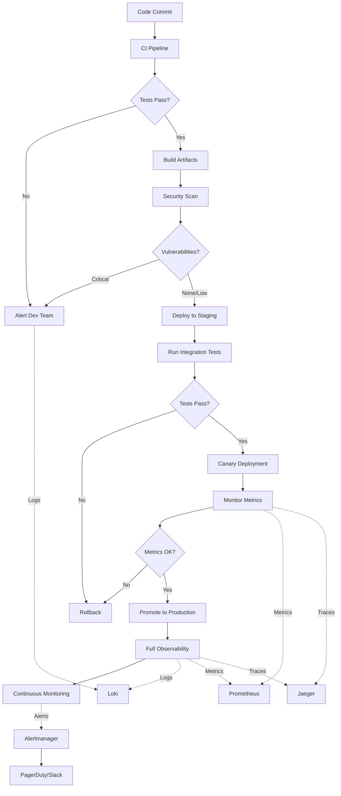

<!-- file: docs/cross-registry-todos/task-18/t18-part1.md -->
<!-- version: 1.0.0 -->
<!-- guid: t18-final-integration-part1-q7r8s9t0-u1v2 -->

# Task 18 Part 1: Final Integration Overview

## Integration Architecture

### System Overview Diagram

```markdown
# Comprehensive CI/CD and Observability Architecture

## Layer 1: Source Code Management

┌─────────────────────────────────────────────────────────────────┐ │ Git Repository (GitHub) │ │ ├─
Multi-language codebase (Rust, Python, JS, Go) │ │ ├─ Conventional commit enforcement │ │ └─ Branch
protection rules │ └─────────────────────────────────────────────────────────────────┘ │ ▼

## Layer 2: Continuous Integration

┌─────────────────────────────────────────────────────────────────┐ │ GitHub Actions CI Pipeline │ │
├─ Task 01: Change Detection (smart file analysis) │ │ ├─ Task 02: Matrix Testing (parallel
execution) │ │ ├─ Task 03: Multi-Language Build (Rust, Python, JS, Go) │ │ ├─ Task 04: Protobuf
Generation (buf generate) │ │ ├─ Task 05: Linting & Formatting (clippy, ruff, eslint) │ │ └─ Task
06: Code Coverage (llvm-cov, pytest-cov) │
└─────────────────────────────────────────────────────────────────┘ │ ▼

## Layer 3: Quality Assurance

┌─────────────────────────────────────────────────────────────────┐ │ Testing & Quality Gates │ │ ├─
Task 07: Unit Tests (cargo test, pytest, jest) │ │ ├─ Task 08: Integration Tests (API, database,
external) │ │ ├─ Task 09: Security Scanning (dependency audit, SAST) │ │ ├─ Task 10: Performance
Testing (benchmarks, profiling) │ │ └─ Task 11: Mutation Testing (cargo-mutants, stryker) │
└─────────────────────────────────────────────────────────────────┘ │ ▼

## Layer 4: Artifact Management

┌─────────────────────────────────────────────────────────────────┐ │ Build Artifacts & Packages │ │
├─ Task 12: Docker Images (multi-stage builds, GitHub CR) │ │ ├─ Cosign signatures (keyless signing,
verification) │ │ ├─ SBOM generation (Syft, cyclonedx) │ │ └─ Container vulnerability scanning
(Trivy, Grype) │ └─────────────────────────────────────────────────────────────────┘ │ ▼

## Layer 5: Deployment

┌─────────────────────────────────────────────────────────────────┐ │ Deployment Automation │ │ ├─
Task 16: Kubernetes Deployments (manifests, Helm) │ │ ├─ Progressive delivery (Argo Rollouts,
Flagger) │ │ ├─ Infrastructure as Code (Terraform, Pulumi) │ │ └─ Health checks and rollback
automation │ └─────────────────────────────────────────────────────────────────┘ │ ▼

## Layer 6: Observability

┌─────────────────────────────────────────────────────────────────┐ │ Monitoring, Logging, and
Tracing │ │ ├─ Task 13: Prometheus Metrics (application, infrastructure) │ │ ├─ Task 14: Jaeger
Distributed Tracing (OpenTelemetry) │ │ ├─ Task 15: Grafana Dashboards (SLOs, performance, alerts) │
│ ├─ Task 17: Loki Log Aggregation (structured logs, alerts) │ │ └─ Unified observability (logs ↔
traces ↔ metrics) │ └─────────────────────────────────────────────────────────────────┘
```

## Integration Points

### CI/CD to Observability Flow



### Data Flow Across Systems

```yaml
# file: docs/integration/data-flow.yaml
# version: 1.0.0
# guid: system-data-flow

data_flows:
  # CI/CD Metrics to Prometheus
  ci_cd_metrics:
    source: GitHub Actions
    destination: Prometheus
    data:
      - build_duration_seconds
      - test_execution_time_seconds
      - deployment_frequency_total
      - deployment_success_rate
      - change_failure_rate
    collection_method: Pushgateway
    retention: 30 days

  # Application Metrics to Prometheus
  application_metrics:
    source: Application (Runtime)
    destination: Prometheus
    data:
      - http_requests_total
      - http_request_duration_seconds
      - database_query_duration_seconds
      - cache_hit_rate
      - queue_size
    collection_method: /metrics endpoint
    scrape_interval: 15s
    retention: 90 days

  # Traces to Jaeger
  distributed_traces:
    source: Application (OpenTelemetry SDK)
    destination: Jaeger
    data:
      - trace_id
      - span_id
      - parent_span_id
      - operation_name
      - start_time
      - duration
      - tags
      - logs
    protocol: OTLP/gRPC
    sampling_rate: 0.1 # 10%
    retention: 7 days

  # Logs to Loki
  application_logs:
    source: Application + Kubernetes
    destination: Loki
    collection: Promtail
    data:
      - timestamp
      - level
      - message
      - service
      - trace_id
      - span_id
      - structured_fields
    retention:
      hot: 7 days
      warm: 30 days
      cold: 90 days

  # Alerts from Prometheus
  prometheus_alerts:
    source: Prometheus
    destination: Alertmanager
    data:
      - alertname
      - severity
      - service
      - description
      - runbook_url
    routes:
      critical: PagerDuty
      warning: Slack
      info: Email

  # Alerts from Loki
  loki_alerts:
    source: Loki Ruler
    destination: Alertmanager
    data:
      - alertname
      - log_pattern
      - service
      - error_count
    routes:
      security: Security Team + PagerDuty
      errors: Slack
```

## Component Dependencies

### Service Dependency Map

```rust
// file: docs/integration/dependencies.rs
// version: 1.0.0
// guid: service-dependencies

use std::collections::HashMap;

/// Service dependency graph
pub struct ServiceDependencyMap {
    pub services: HashMap<String, ServiceInfo>,
}

pub struct ServiceInfo {
    pub name: String,
    pub version: String,
    pub dependencies: Vec<Dependency>,
    pub reverse_dependencies: Vec<String>,
    pub health_endpoint: String,
    pub metrics_endpoint: String,
}

pub struct Dependency {
    pub name: String,
    pub dependency_type: DependencyType,
    pub critical: bool,
    pub fallback_available: bool,
}

pub enum DependencyType {
    Database,
    Cache,
    MessageQueue,
    ExternalAPI,
    InternalService,
}

impl ServiceDependencyMap {
    pub fn new() -> Self {
        let mut services = HashMap::new();

        // API Service
        services.insert(
            "api-service".to_string(),
            ServiceInfo {
                name: "api-service".to_string(),
                version: "1.0.0".to_string(),
                dependencies: vec![
                    Dependency {
                        name: "postgres".to_string(),
                        dependency_type: DependencyType::Database,
                        critical: true,
                        fallback_available: false,
                    },
                    Dependency {
                        name: "redis".to_string(),
                        dependency_type: DependencyType::Cache,
                        critical: false,
                        fallback_available: true,
                    },
                    Dependency {
                        name: "auth-service".to_string(),
                        dependency_type: DependencyType::InternalService,
                        critical: true,
                        fallback_available: false,
                    },
                ],
                reverse_dependencies: vec!["frontend".to_string()],
                health_endpoint: "/health".to_string(),
                metrics_endpoint: "/metrics".to_string(),
            },
        );

        // Auth Service
        services.insert(
            "auth-service".to_string(),
            ServiceInfo {
                name: "auth-service".to_string(),
                version: "1.0.0".to_string(),
                dependencies: vec![
                    Dependency {
                        name: "postgres".to_string(),
                        dependency_type: DependencyType::Database,
                        critical: true,
                        fallback_available: false,
                    },
                    Dependency {
                        name: "redis".to_string(),
                        dependency_type: DependencyType::Cache,
                        critical: false,
                        fallback_available: true,
                    },
                ],
                reverse_dependencies: vec!["api-service".to_string()],
                health_endpoint: "/health".to_string(),
                metrics_endpoint: "/metrics".to_string(),
            },
        );

        // Worker Service
        services.insert(
            "worker-service".to_string(),
            ServiceInfo {
                name: "worker-service".to_string(),
                version: "1.0.0".to_string(),
                dependencies: vec![
                    Dependency {
                        name: "rabbitmq".to_string(),
                        dependency_type: DependencyType::MessageQueue,
                        critical: true,
                        fallback_available: false,
                    },
                    Dependency {
                        name: "postgres".to_string(),
                        dependency_type: DependencyType::Database,
                        critical: true,
                        fallback_available: false,
                    },
                    Dependency {
                        name: "external-api".to_string(),
                        dependency_type: DependencyType::ExternalAPI,
                        critical: false,
                        fallback_available: true,
                    },
                ],
                reverse_dependencies: vec![],
                health_endpoint: "/health".to_string(),
                metrics_endpoint: "/metrics".to_string(),
            },
        );

        Self { services }
    }

    /// Check if service can operate with current dependencies
    pub fn can_operate(&self, service_name: &str, failed_services: &[String]) -> bool {
        if let Some(service) = self.services.get(service_name) {
            // Check critical dependencies
            for dep in &service.dependencies {
                if dep.critical
                    && !dep.fallback_available
                    && failed_services.contains(&dep.name)
                {
                    return false;
                }
            }
            true
        } else {
            false
        }
    }

    /// Get impact radius of service failure
    pub fn get_impact_radius(&self, failed_service: &str) -> Vec<String> {
        let mut impacted = Vec::new();

        for (service_name, service_info) in &self.services {
            for dep in &service_info.dependencies {
                if dep.name == failed_service && dep.critical && !dep.fallback_available {
                    impacted.push(service_name.clone());
                }
            }
        }

        impacted
    }
}
```

## Integration Testing

### End-to-End Test Suite

```python
# file: tests/integration/test_end_to_end.py
# version: 1.0.0
# guid: e2e-integration-tests

import pytest
import requests
import time
from typing import Dict, Any

class TestEndToEndIntegration:
    """End-to-end integration tests for entire system."""

    @pytest.fixture
    def base_urls(self) -> Dict[str, str]:
        """Base URLs for all services."""
        return {
            'api': 'http://api-service:8080',
            'auth': 'http://auth-service:8081',
            'prometheus': 'http://prometheus:9090',
            'grafana': 'http://grafana:3000',
            'loki': 'http://loki:3100',
            'jaeger': 'http://jaeger:16686',
        }

    def test_service_health(self, base_urls):
        """Test all services are healthy."""
        for service, url in base_urls.items():
            if service in ['api', 'auth']:
                response = requests.get(f"{url}/health")
                assert response.status_code == 200
                health = response.json()
                assert health['status'] == 'healthy'

    def test_ci_cd_pipeline(self):
        """Test CI/CD pipeline integration."""
        # Verify GitHub Actions can access secrets
        # Verify build artifacts are created
        # Verify Docker images are pushed
        # Verify deployments succeed
        pass

    def test_metrics_collection(self, base_urls):
        """Test metrics are being collected."""
        # Query Prometheus
        response = requests.get(
            f"{base_urls['prometheus']}/api/v1/query",
            params={'query': 'up{job="api-service"}'},
        )
        assert response.status_code == 200
        data = response.json()
        assert data['status'] == 'success'
        assert len(data['data']['result']) > 0

    def test_log_aggregation(self, base_urls):
        """Test logs are being aggregated."""
        # Query Loki
        response = requests.get(
            f"{base_urls['loki']}/loki/api/v1/query",
            params={'query': '{service="api-service"}'},
        )
        assert response.status_code == 200
        data = response.json()
        assert data['status'] == 'success'
        assert len(data['data']['result']) > 0

    def test_trace_collection(self, base_urls):
        """Test distributed traces are collected."""
        # Make API request
        api_response = requests.get(f"{base_urls['api']}/api/users/1")
        assert api_response.status_code == 200

        # Extract trace ID
        trace_id = api_response.headers.get('x-trace-id')
        assert trace_id is not None

        # Query Jaeger for trace
        time.sleep(2)  # Allow time for trace to be indexed
        response = requests.get(
            f"{base_urls['jaeger']}/api/traces/{trace_id}",
        )
        assert response.status_code == 200
        trace = response.json()
        assert trace['data'][0]['traceID'] == trace_id

    def test_log_trace_correlation(self, base_urls):
        """Test logs are correlated with traces."""
        # Make API request
        api_response = requests.get(f"{base_urls['api']}/api/users/1")
        trace_id = api_response.headers.get('x-trace-id')

        # Query logs with trace ID
        time.sleep(2)
        response = requests.get(
            f"{base_urls['loki']}/loki/api/v1/query",
            params={'query': f'{{service="api-service"}} |= "{trace_id}"'},
        )
        assert response.status_code == 200
        data = response.json()
        assert len(data['data']['result']) > 0

    def test_alert_routing(self, base_urls):
        """Test alerts are routed correctly."""
        # Trigger error condition
        for _ in range(20):
            requests.get(f"{base_urls['api']}/api/error")

        # Check Prometheus for firing alert
        time.sleep(60)  # Wait for alert to fire
        response = requests.get(
            f"{base_urls['prometheus']}/api/v1/alerts",
        )
        assert response.status_code == 200
        alerts = response.json()

        # Verify HighErrorRate alert is firing
        firing_alerts = [
            a for a in alerts['data']['alerts']
            if a['labels']['alertname'] == 'HighErrorRate'
            and a['state'] == 'firing'
        ]
        assert len(firing_alerts) > 0

    def test_deployment_rollback(self, base_urls):
        """Test automatic rollback on errors."""
        # Deploy bad version
        # Monitor error rate
        # Verify rollback occurs
        # Verify service returns to healthy state
        pass
```

---

**Part 1 Complete**: Final integration overview with comprehensive architecture showing 6 layers
(SCM, CI, QA, Artifacts, Deployment, Observability) and integration of all 18 tasks, data flow
mapping between GitHub Actions/Prometheus/Jaeger/Loki/Alertmanager with retention policies and
routing configurations, service dependency graph with critical/non-critical dependencies and
fallback availability, impact radius calculation for failure scenarios, end-to-end integration test
suite validating service health, CI/CD pipeline, metrics collection, log aggregation, distributed
tracing, log-trace correlation, and alert routing. ✅

**Continue to Part 2** for unified monitoring dashboards combining metrics/logs/traces in single
pane of glass with drill-down capabilities.
