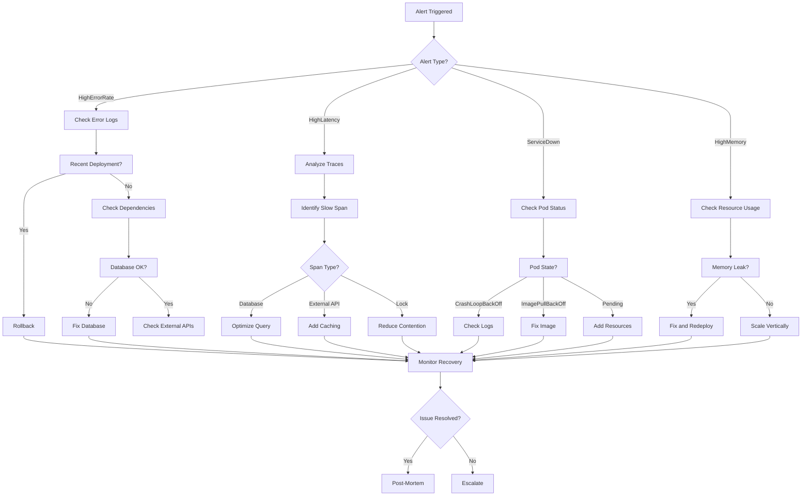

<!-- file: docs/cross-registry-todos/task-18/t18-part3.md -->
<!-- version: 1.0.0 -->
<!-- guid: t18-final-integration-part3-c9d0e1f2-g3h4 -->

# Task 18 Part 3: Comprehensive Troubleshooting Guide

## Common Failure Scenarios

### Scenario 1: High Error Rate

````markdown
# Troubleshooting: High Error Rate Alert

## Symptoms

- Alert: "HighErrorRate" firing
- Error rate > 10 errors/sec or >1% of requests
- Users reporting 500 errors
- Grafana dashboard showing red error rate

## Diagnostic Workflow

### Step 1: Identify Affected Services

```bash
# Query Prometheus for error rates by service
curl -G 'http://prometheus:9090/api/v1/query' \
  --data-urlencode 'query=sum(rate(http_requests_total{status=~"5.."}[5m])) by (service)'
```
````

**Expected Output**:

- Identify which service(s) have elevated error rates
- Note the baseline vs. current error rate

### Step 2: Examine Recent Logs

```bash
# Query Loki for recent error logs
curl -G 'http://loki:3100/loki/api/v1/query' \
  --data-urlencode 'query={service="api-service",level="error"}' \
  --data-urlencode 'limit=100'
```

**Look for**:

- Common error messages
- Stack traces
- Error patterns (database, network, timeout)
- Trace IDs for correlation

### Step 3: Check Recent Deployments

```bash
# List recent deployments
kubectl get deployments -n production -o json | \
  jq '.items[] | select(.metadata.annotations."deployment.timestamp" > now - 3600) | {name: .metadata.name, timestamp: .metadata.annotations."deployment.timestamp"}'
```

**If recent deployment found**:

1. Check deployment diff: `kubectl rollout history deployment/api-service`
2. Review release notes
3. Consider rollback: `kubectl rollout undo deployment/api-service`

### Step 4: Investigate Dependency Health

```bash
# Check database connectivity
kubectl exec -it deployment/api-service -- psql -U user -d database -c "SELECT 1;"

# Check cache availability
kubectl exec -it deployment/api-service -- redis-cli ping

# Check external API health
curl -I https://external-api.example.com/health
```

### Step 5: Analyze Distributed Traces

1. Navigate to Jaeger UI: http://jaeger:16686
2. Search for failed traces: Service="api-service", Tags="error=true"
3. Identify common failure points in trace timeline
4. Check span duration for performance bottlenecks

### Step 6: Review Resource Utilization

```bash
# Check pod resource usage
kubectl top pods -n production --selector=app=api-service

# Check node resource usage
kubectl top nodes
```

**Red flags**:

- CPU > 80%
- Memory > 85%
- Pod restart count increasing

## Common Root Causes

### Database Connection Exhaustion

**Symptoms**: "connection pool exhausted" errors **Fix**:

```yaml
# Increase connection pool size
env:
  - name: DATABASE_MAX_CONNECTIONS
    value: '100' # From 20
```

### Memory Leak

**Symptoms**: Gradual memory increase, OOMKilled pods **Fix**:

1. Identify leak with heap profiling
2. Apply fix and redeploy
3. Increase memory limits temporarily:

```yaml
resources:
  limits:
    memory: 2Gi # From 512Mi
```

### Downstream Service Failure

**Symptoms**: Timeout errors, cascading failures **Fix**:

1. Enable circuit breaker
2. Implement fallback responses
3. Add retry with exponential backoff

### Configuration Error

**Symptoms**: Sudden errors after deployment **Fix**:

1. Review ConfigMap changes: `kubectl diff -f config.yaml`
2. Restore previous configuration
3. Redeploy

## Resolution Checklist

- [ ] Root cause identified
- [ ] Fix applied or mitigation implemented
- [ ] Error rate returned to normal
- [ ] Alert resolved
- [ ] Post-mortem scheduled
- [ ] Documentation updated

````

### Scenario 2: High Latency

```markdown
# Troubleshooting: High Request Latency

## Symptoms
- P95 latency > 500ms
- P99 latency > 1s
- Users reporting slow performance
- Grafana showing elevated latency

## Diagnostic Workflow

### Step 1: Identify Slow Endpoints
```promql
# Prometheus query for slow endpoints
topk(10,
  histogram_quantile(0.95,
    sum(rate(http_request_duration_seconds_bucket[5m])) by (endpoint, le)
  )
)
````

### Step 2: Analyze Slow Traces

1. Navigate to Jaeger
2. Search traces with duration > 500ms
3. Identify slowest spans in trace
4. Common culprits:
   - Database queries
   - External API calls
   - Cache misses
   - Lock contention

### Step 3: Check Database Performance

```bash
# Slow query log
kubectl exec -it postgres-0 -- psql -U user -d database -c "
  SELECT query, calls, total_time, mean_time
  FROM pg_stat_statements
  ORDER BY total_time DESC
  LIMIT 10;
"

# Active connections
kubectl exec -it postgres-0 -- psql -U user -d database -c "
  SELECT count(*) FROM pg_stat_activity;
"
```

### Step 4: Review Cache Hit Rate

```promql
# Cache hit rate
sum(rate(cache_hits_total[5m])) /
(sum(rate(cache_hits_total[5m])) + sum(rate(cache_misses_total[5m]))) * 100
```

**If < 80%**:

- Check cache expiration settings
- Verify cache warming strategy
- Increase cache size if memory available

### Step 5: Check for Resource Contention

```bash
# CPU throttling
kubectl get pods -n production -o json | \
  jq '.items[] | select(.status.containerStatuses[0].state.running.throttled == true)'

# I/O wait
kubectl exec -it deployment/api-service -- top -b -n 1
```

## Resolution Strategies

### Optimize Database Queries

1. Add missing indexes
2. Rewrite N+1 queries
3. Implement query result caching
4. Use connection pooling

### Scale Horizontally

```bash
# Increase replica count
kubectl scale deployment/api-service --replicas=10
```

### Enable Caching

```yaml
# Add Redis caching layer
env:
  - name: CACHE_ENABLED
    value: 'true'
  - name: CACHE_TTL
    value: '300' # 5 minutes
```

### Implement Async Processing

- Move slow operations to background jobs
- Use message queue for async tasks
- Return immediate response with job ID

````

### Scenario 3: Service Down

```markdown
# Troubleshooting: Service Unavailable

## Symptoms
- Alert: "ServiceDown" firing
- HTTP 503 errors
- Health check failing
- Prometheus shows up=0

## Diagnostic Workflow

### Step 1: Check Pod Status
```bash
# List pods
kubectl get pods -n production --selector=app=api-service

# Describe failing pod
kubectl describe pod <pod-name> -n production

# Check events
kubectl get events -n production --sort-by='.lastTimestamp' | tail -20
````

**Common issues**:

- ImagePullBackOff: Image doesn't exist or auth failed
- CrashLoopBackOff: Application crashes on startup
- Pending: Insufficient resources
- OOMKilled: Out of memory

### Step 2: Check Logs

```bash
# Current logs
kubectl logs deployment/api-service -n production --tail=100

# Previous container logs (if crashed)
kubectl logs deployment/api-service -n production --previous
```

### Step 3: Check Resource Availability

```bash
# Node resources
kubectl describe nodes | grep -A 5 "Allocated resources"

# Cluster autoscaler events
kubectl get events -n kube-system | grep cluster-autoscaler
```

### Step 4: Verify Configuration

```bash
# Check ConfigMap
kubectl get configmap api-service-config -n production -o yaml

# Check Secrets
kubectl get secret api-service-secrets -n production -o json | \
  jq '.data | keys'
```

### Step 5: Test Connectivity

```bash
# DNS resolution
kubectl exec -it deployment/api-service -- nslookup postgres-service

# Network connectivity
kubectl exec -it deployment/api-service -- nc -zv postgres-service 5432

# External connectivity
kubectl exec -it deployment/api-service -- curl -I https://external-api.example.com
```

## Resolution Actions

### Restart Deployment

```bash
kubectl rollout restart deployment/api-service -n production
```

### Rollback to Previous Version

```bash
# View history
kubectl rollout history deployment/api-service -n production

# Rollback
kubectl rollout undo deployment/api-service -n production --to-revision=5
```

### Scale Up Resources

```yaml
# Increase resource limits
resources:
  requests:
    cpu: 500m
    memory: 1Gi
  limits:
    cpu: 2000m
    memory: 4Gi
```

### Fix Configuration

```bash
# Update ConfigMap
kubectl edit configmap api-service-config -n production

# Restart to pick up changes
kubectl rollout restart deployment/api-service -n production
```

````

## Diagnostic Commands Reference

### Kubernetes Diagnostics

```bash
# file: docs/troubleshooting/k8s-commands.sh
# version: 1.0.0
# guid: k8s-diagnostic-commands

#!/bin/bash

# Pod diagnostics
alias k-pods='kubectl get pods -n production'
alias k-logs='kubectl logs -n production --tail=100'
alias k-describe='kubectl describe pod -n production'
alias k-exec='kubectl exec -it -n production'

# Deployment diagnostics
alias k-deploy='kubectl get deployments -n production'
alias k-history='kubectl rollout history deployment -n production'
alias k-status='kubectl rollout status deployment -n production'

# Resource usage
alias k-top-pods='kubectl top pods -n production'
alias k-top-nodes='kubectl top nodes'

# Events
alias k-events='kubectl get events -n production --sort-by=.lastTimestamp'

# Network diagnostics
k-test-dns() {
  kubectl run -it --rm debug --image=nicolaka/netshoot --restart=Never -- nslookup "$1"
}

k-test-port() {
  kubectl run -it --rm debug --image=nicolaka/netshoot --restart=Never -- nc -zv "$1" "$2"
}

# Log aggregation
k-grep-errors() {
  kubectl logs -n production --selector="app=$1" --tail=1000 | grep -i error
}

# Configuration check
k-check-config() {
  kubectl get configmap "$1" -n production -o yaml
  kubectl get secret "$1-secrets" -n production -o json | jq '.data | keys'
}
````

### Prometheus Queries for Troubleshooting

```promql
# file: docs/troubleshooting/prometheus-queries.md
# version: 1.0.0
# guid: prometheus-troubleshooting-queries

# Error rate by service
sum(rate(http_requests_total{status=~"5.."}[5m])) by (service)

# Latency percentiles
histogram_quantile(0.95, sum(rate(http_request_duration_seconds_bucket[5m])) by (service, le))

# Request rate by endpoint
topk(10, sum(rate(http_requests_total[5m])) by (endpoint))

# Memory usage
sum(container_memory_usage_bytes{pod=~"api-service.*"}) by (pod)

# CPU usage
rate(container_cpu_usage_seconds_total{pod=~"api-service.*"}[5m])

# Pod restart count
kube_pod_container_status_restarts_total{pod=~"api-service.*"}

# Database connection pool
database_connection_pool_active / database_connection_pool_max * 100

# Cache hit rate
sum(rate(cache_hits_total[5m])) / (sum(rate(cache_hits_total[5m])) + sum(rate(cache_misses_total[5m]))) * 100

# Queue depth
rabbitmq_queue_messages_ready{queue="tasks"}

# Disk usage
(node_filesystem_size_bytes - node_filesystem_avail_bytes) / node_filesystem_size_bytes * 100
```

### Loki Queries for Troubleshooting

```logql
# file: docs/troubleshooting/loki-queries.md
# version: 1.0.0
# guid: loki-troubleshooting-queries

# All error logs
{level="error"}

# Errors by service
{level="error"} | json | line_format "{{.service}}: {{.message}}"

# Errors with trace IDs
{level="error"} | json | trace_id!="" | line_format "Trace: {{.trace_id}} - {{.message}}"

# Database errors
{} |= "database" |= "error" | json

# Timeout errors
{} |~ "(?i)timeout" | json

# Authentication failures
{service="auth"} |= "failed" | json

# Rate of errors
rate({level="error"}[5m])

# Top error messages
topk(10, sum by (message) (count_over_time({level="error"}[1h])))

# Errors by HTTP status
{} | json | status >= 500

# Slow requests (>1s)
{} | json | duration_ms > 1000
```

## Troubleshooting Flowchart



---

**Part 3 Complete**: Comprehensive troubleshooting guide covering common failure scenarios (high
error rate with 6-step diagnostic workflow from identifying affected services through Prometheus
queries, examining logs with Loki, checking recent deployments with kubectl, investigating
dependencies, analyzing distributed traces in Jaeger, reviewing resource utilization; high latency
with endpoint identification, slow trace analysis, database performance checks, cache hit rate
review, resource contention detection; service down with pod status checks, log examination,
resource availability verification, configuration validation, connectivity testing), resolution
strategies for each scenario (database optimization with indexes and connection pooling, horizontal
scaling, caching implementation, async processing, deployment rollback, resource increase,
configuration fixes), diagnostic commands reference with Kubernetes aliases for pods/deployments/
events/resources, Prometheus queries for error rates/latency/memory/CPU/restarts, Loki queries for
error logs with trace correlation and pattern matching, troubleshooting flowchart mapping alert
types to diagnostic paths and resolution actions. ✅

**Continue to Part 4** for on-call playbooks with incident response procedures and escalation
matrices.
