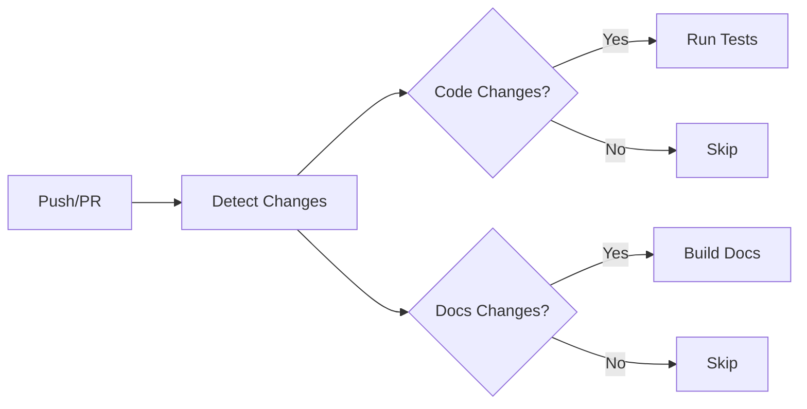

<!-- file: docs/refactors/workflows/v2/implementation/ci-workflows.md -->
<!-- version: 1.0.0 -->
<!-- guid: a1b2c3d4-e5f6-7a8b-9c0d-1e2f3a4b5c6d -->

# CI Workflows Implementation Guide

## Overview

This guide provides detailed instructions for implementing branch-aware CI workflows with the v2 system. It covers change detection, matrix generation, parallel execution, and Super Linter integration.

**Target Audience**: Developers implementing CI workflows in repositories
**Prerequisites**:
- Completed Phase 0 (Foundation) and Phase 1 (CI Modernization)
- Python 3.13+ installed
- GitHub Actions experience

## Quick Start

### Minimal CI Implementation

Create `.github/workflows/ci.yml`:

```yaml
name: CI

on:
  push:
    branches: [main, 'stable-1-**']
  pull_request:
    branches: [main, 'stable-1-**']

permissions:
  contents: read

jobs:
  detect-changes:
    name: Detect Changes
    uses: ./.github/workflows/reusable-change-detection.yml

  test:
    name: Test
    needs: detect-changes
    if: needs.detect-changes.outputs.has_code_changes == 'true'
    uses: ./.github/workflows/reusable-ci-matrix.yml
    with:
      language: go
```

This provides:
- Branch-aware version selection
- Change detection for efficient runs
- Parallel matrix execution

## Branch-Aware Configuration

### Version Configuration

Create `.github/workflow-versions.yml`:

```yaml
# file: .github/workflow-versions.yml
# version: 1.0.0

version_policies:
  # Main branch - latest versions
  main:
    go:
      versions: ["1.25"]
      default: "1.25"
    python:
      versions: ["3.14"]
      default: "3.14"
    node:
      versions: ["22"]
      default: "22"
    rust:
      versions: ["stable"]
      default: "stable"

  # Go 1.24 maintenance branch
  stable-1-go-1.24:
    go:
      versions: ["1.24"]
      default: "1.24"
    python:
      versions: ["3.13", "3.14"]
      default: "3.13"
    lifecycle:
      created: "2025-02-01"
      work_stops_at: "2025-08-01"  # When 1.26 released
      lock_after_days: 180

  # Go 1.23 maintenance branch (approaching lock)
  stable-1-go-1.23:
    go:
      versions: ["1.23"]
      default: "1.23"
    python:
      versions: ["3.12", "3.13"]
      default: "3.12"
    lifecycle:
      created: "2024-08-01"
      work_stops_at: "2025-02-01"
      lock_after_days: 180
```

### Branch Creation

Create new stable branch:

```bash
# Create stable-1 branch for Go 1.24
git checkout -b stable-1-go-1.24 main

# Update workflow-versions.yml to add branch policy
# (See example above)

# Commit and push
git add .github/workflow-versions.yml
git commit -m "feat(ci): add Go 1.24 stable branch"
git push -u origin stable-1-go-1.24

# Create GitHub branch protection rule
gh api repos/:owner/:repo/branches/stable-1-go-1.24/protection \
  --method PUT \
  --field required_status_checks='{"strict":true,"contexts":["test"]}' \
  --field enforce_admins=true
```

## Change Detection

### How It Works

The change detection system analyzes git diffs to determine which workflows need to run:



### Configuration

Enable change detection in your workflow:

```yaml
jobs:
  detect-changes:
    name: Detect Changes
    runs-on: ubuntu-latest
    outputs:
      go_files: ${{ steps.changes.outputs.go_files }}
      python_files: ${{ steps.changes.outputs.python_files }}
      rust_files: ${{ steps.changes.outputs.rust_files }}
      docs_files: ${{ steps.changes.outputs.docs_files }}
      workflow_files: ${{ steps.changes.outputs.workflow_files }}
      has_code_changes: ${{ steps.changes.outputs.has_code_changes }}
    steps:
      - name: Checkout
        uses: actions/checkout@v4
        with:
          fetch-depth: 0  # Full history for accurate diff

      - name: Set up Python
        uses: actions/setup-python@v5
        with:
          python-version: '3.14'

      - name: Detect changes
        id: changes
        run: |
          python .github/workflows/scripts/ci_workflow.py detect-changes
```

### Custom Change Patterns

Define custom file patterns in your workflow:

```python
# Custom change detection script
from pathlib import Path
import ci_workflow

def detect_custom_changes(base_ref: str, head_ref: str) -> dict:
    """Detect changes in custom file patterns."""
    changes = ci_workflow.detect_changes(base_ref, head_ref)

    # Add custom pattern
    proto_files = ci_workflow._get_changed_files_by_pattern(
        base_ref, head_ref, "**/*.proto"
    )
    changes["proto_files"] = proto_files
    changes["has_proto_changes"] = len(proto_files) > 0

    return changes
```

## Matrix Generation

### Basic Matrix

Generate test matrix based on branch:

```yaml
jobs:
  generate-matrix:
    name: Generate Test Matrix
    runs-on: ubuntu-latest
    outputs:
      matrix: ${{ steps.matrix.outputs.matrix }}
    steps:
      - name: Checkout
        uses: actions/checkout@v4

      - name: Set up Python
        uses: actions/setup-python@v5
        with:
          python-version: '3.14'

      - name: Generate matrix
        id: matrix
        run: |
          python .github/workflows/scripts/ci_workflow.py generate-matrix \
            --language go

  test:
    name: Test (Go ${{ matrix.go }}, ${{ matrix.os }})
    needs: generate-matrix
    strategy:
      matrix: ${{ fromJSON(needs.generate-matrix.outputs.matrix) }}
    runs-on: ${{ matrix.os }}
    steps:
      - name: Set up Go
        uses: actions/setup-go@v5
        with:
          go-version: ${{ matrix.go }}

      - name: Run tests
        run: go test -v ./...
```

### Multi-Language Matrix

Test multiple languages with appropriate versions:

```yaml
jobs:
  generate-matrices:
    name: Generate Matrices
    runs-on: ubuntu-latest
    outputs:
      go-matrix: ${{ steps.go.outputs.matrix }}
      python-matrix: ${{ steps.python.outputs.matrix }}
      rust-matrix: ${{ steps.rust.outputs.matrix }}
    steps:
      - name: Checkout
        uses: actions/checkout@v4

      - name: Set up Python
        uses: actions/setup-python@v5
        with:
          python-version: '3.14'

      - name: Generate Go matrix
        id: go
        run: |
          python .github/workflows/scripts/ci_workflow.py generate-matrix \
            --language go

      - name: Generate Python matrix
        id: python
        run: |
          python .github/workflows/scripts/ci_workflow.py generate-matrix \
            --language python

      - name: Generate Rust matrix
        id: rust
        run: |
          python .github/workflows/scripts/ci_workflow.py generate-matrix \
            --language rust

  test-go:
    name: Test Go
    needs: generate-matrices
    if: needs.detect-changes.outputs.go_files != ''
    strategy:
      matrix: ${{ fromJSON(needs.generate-matrices.outputs.go-matrix) }}
    runs-on: ${{ matrix.os }}
    steps:
      - uses: actions/setup-go@v5
        with:
          go-version: ${{ matrix.go }}
      - run: go test ./...

  test-python:
    name: Test Python
    needs: generate-matrices
    if: needs.detect-changes.outputs.python_files != ''
    strategy:
      matrix: ${{ fromJSON(needs.generate-matrices.outputs.python-matrix) }}
    runs-on: ${{ matrix.os }}
    steps:
      - uses: actions/setup-python@v5
        with:
          python-version: ${{ matrix.python }}
      - run: pytest tests/
```

## Parallel Execution

### Job Dependencies

Optimize workflow execution with proper dependencies:

```yaml
jobs:
  # Fast checks first
  lint:
    name: Lint
    runs-on: ubuntu-latest
    steps:
      - uses: actions/checkout@v4
      - run: golangci-lint run

  # Parallel after lint passes
  test-unit:
    name: Unit Tests
    needs: lint
    runs-on: ubuntu-latest
    steps:
      - run: go test -short ./...

  test-integration:
    name: Integration Tests
    needs: lint
    runs-on: ubuntu-latest
    steps:
      - run: go test -run Integration ./...

  # Final step requires all tests
  coverage:
    name: Coverage Report
    needs: [test-unit, test-integration]
    runs-on: ubuntu-latest
    steps:
      - run: go tool cover -html=coverage.out
```

### Matrix Optimization

Use matrix.include for specific combinations:

```yaml
strategy:
  matrix:
    go: ['1.23', '1.24', '1.25']
    os: [ubuntu-latest, macos-latest]
    # Exclude specific combinations
    exclude:
      - go: '1.23'
        os: macos-latest  # Don't test old version on macOS
    # Add specific combinations
    include:
      - go: '1.25'
        os: ubuntu-latest
        race: true  # Only race detection on latest Go
```

## Super Linter Integration

### Basic Configuration

Add Super Linter to CI:

```yaml
jobs:
  lint:
    name: Super Linter
    runs-on: ubuntu-latest
    steps:
      - name: Checkout
        uses: actions/checkout@v4
        with:
          fetch-depth: 0

      - name: Run Super Linter
        uses: super-linter/super-linter@v6
        env:
          GITHUB_TOKEN: ${{ secrets.GITHUB_TOKEN }}
          VALIDATE_ALL_CODEBASE: ${{ github.event_name == 'push' && github.ref == 'refs/heads/main' }}
```

### Configuration Files

Create `.github/linters/super-linter-ci.env`:

```bash
# file: .github/linters/super-linter-ci.env
# version: 1.0.0

# GitHub Super Linter Configuration

# Validation
VALIDATE_GO=true
VALIDATE_PYTHON_BLACK=true
VALIDATE_PYTHON_RUFF=true
VALIDATE_MARKDOWN=true
VALIDATE_YAML=true
VALIDATE_JSON=true

# Configuration files
PYTHON_BLACK_CONFIG_FILE=.github/linters/.python-black
PYTHON_RUFF_CONFIG_FILE=ruff.toml
MARKDOWN_CONFIG_FILE=.github/linters/.markdown-lint.yml
YAML_CONFIG_FILE=.github/linters/.yaml-lint.yml

# Directories to lint
DEFAULT_WORKSPACE=/tmp/lint

# Output
LOG_LEVEL=VERBOSE
CREATE_LOG_FILE=true
```

### Language-Specific Rules

Configure linters for each language:

**.github/linters/.python-black**:
```ini
[tool.black]
line-length = 88
target-version = ['py313', 'py314']
```

**.github/linters/.markdown-lint.yml**:
```yaml
# Google-style markdown
line-length: 100
no-duplicate-heading: true
no-trailing-punctuation:
  punctuation: ".,;:!"
```

**.github/linters/.yaml-lint.yml**:
```yaml
extends: default
rules:
  line-length:
    max: 120
  indentation:
    spaces: 2
```

## Conditional Execution

### Skip Rules

Skip workflows based on commit messages or paths:

```yaml
on:
  push:
    branches: [main]
    paths-ignore:
      - 'docs/**'
      - '**.md'
      - '.github/**'

jobs:
  test:
    name: Test
    if: |
      !contains(github.event.head_commit.message, '[skip ci]') &&
      !contains(github.event.head_commit.message, '[ci skip]')
    runs-on: ubuntu-latest
```

### Branch-Specific Jobs

Run certain jobs only on specific branches:

```yaml
jobs:
  test-latest:
    name: Test Latest Features
    if: github.ref == 'refs/heads/main'
    runs-on: ubuntu-latest
    steps:
      - uses: actions/setup-go@v5
        with:
          go-version: '1.25'

  test-stable:
    name: Test Stable Version
    if: startsWith(github.ref, 'refs/heads/stable-1-')
    runs-on: ubuntu-latest
    steps:
      - name: Determine Go version
        id: go-version
        run: |
          # Extract version from branch name
          BRANCH="${{ github.ref_name }}"
          VERSION="${BRANCH#stable-1-go-}"
          echo "version=$VERSION" >> $GITHUB_OUTPUT

      - uses: actions/setup-go@v5
        with:
          go-version: ${{ steps.go-version.outputs.version }}
```

## Feature Flags

### Using Feature Flags

Enable new CI features gradually:

```yaml
jobs:
  check-features:
    name: Check Feature Flags
    runs-on: ubuntu-latest
    outputs:
      use_new_ci: ${{ steps.flags.outputs.use_new_ci }}
      use_new_linter: ${{ steps.flags.outputs.use_new_linter }}
    steps:
      - name: Checkout
        uses: actions/checkout@v4

      - name: Check flags
        id: flags
        run: |
          python .github/workflows/scripts/workflow_common.py check-feature \
            --feature use_new_ci

  test-v2:
    name: Test (v2)
    needs: check-features
    if: needs.check-features.outputs.use_new_ci == 'true'
    uses: ./.github/workflows/reusable-ci-matrix.yml

  test-v1:
    name: Test (v1)
    needs: check-features
    if: needs.check-features.outputs.use_new_ci != 'true'
    runs-on: ubuntu-latest
    steps:
      - run: go test ./...
```

### Gradual Rollout

Roll out new CI to specific branches first:

```yaml
# workflow-versions.yml
feature_flags:
  use_new_ci:
    enabled_branches:
      - main
      - stable-1-go-1.25
    default: false

  use_new_linter:
    enabled_branches:
      - main
    default: false
```

## Caching Strategy

### Go Module Cache

```yaml
- name: Cache Go modules
  uses: actions/cache@v4
  with:
    path: |
      ~/.cache/go-build
      ~/go/pkg/mod
    key: go-${{ runner.os }}-${{ hashFiles('**/go.sum') }}
    restore-keys: |
      go-${{ runner.os }}-
```

### Rust Cargo Cache

```yaml
- name: Cache Rust
  uses: actions/cache@v4
  with:
    path: |
      ~/.cargo/registry/cache
      ~/.cargo/git/db
      target/
    key: rust-${{ runner.os }}-${{ hashFiles('**/Cargo.lock') }}
    restore-keys: |
      rust-${{ runner.os }}-
```

### Python Dependencies Cache

```yaml
- name: Cache Python
  uses: actions/cache@v4
  with:
    path: ~/.cache/pip
    key: python-${{ runner.os }}-${{ hashFiles('**/requirements.txt') }}
    restore-keys: |
      python-${{ runner.os }}-
```

## Testing Strategy

### Test Organization

Structure tests for efficient CI execution:

```text
tests/
├── unit/           # Fast, no dependencies
│   ├── test_*.py
│   └── *_test.go
├── integration/    # Medium speed, some dependencies
│   ├── test_*.py
│   └── *_test.go
└── e2e/           # Slow, full system
    ├── test_*.py
    └── *_test.go
```

Run appropriate tests based on changes:

```yaml
jobs:
  test-unit:
    name: Unit Tests
    runs-on: ubuntu-latest
    steps:
      - run: go test -short ./...

  test-integration:
    name: Integration Tests
    needs: test-unit
    if: needs.detect-changes.outputs.has_code_changes == 'true'
    runs-on: ubuntu-latest
    steps:
      - run: go test -run Integration ./...

  test-e2e:
    name: E2E Tests
    needs: test-integration
    if: github.ref == 'refs/heads/main'
    runs-on: ubuntu-latest
    steps:
      - run: go test -run E2E ./...
```

## Troubleshooting

### Matrix Generation Fails

**Problem**: Matrix generation produces empty or invalid JSON

**Solution**:
```bash
# Test matrix generation locally
python .github/workflows/scripts/ci_workflow.py generate-matrix \
  --language go \
  --branch main

# Debug with verbose output
python .github/workflows/scripts/ci_workflow.py generate-matrix \
  --language go \
  --branch main \
  --debug
```

### Change Detection Misses Files

**Problem**: Changes not detected for specific file patterns

**Solution**:
1. Verify fetch-depth is 0 in checkout
2. Check file patterns in ci_workflow.py
3. Test locally:

```bash
python .github/workflows/scripts/ci_workflow.py detect-changes \
  --base origin/main \
  --head HEAD
```

### Cache Not Hitting

**Problem**: Cache always misses despite no dependency changes

**Solution**:
```yaml
# Add verbose cache logging
- name: Cache dependencies
  uses: actions/cache@v4
  with:
    path: ~/.cache
    key: ${{ runner.os }}-cache-${{ hashFiles('**/go.sum') }}
    restore-keys: |
      ${{ runner.os }}-cache-
  env:
    ACTIONS_STEP_DEBUG: true
```

## Best Practices

1. **Change Detection First**: Always run change detection before expensive operations
2. **Fail Fast**: Run linting and fast tests before slow integration tests
3. **Parallel When Possible**: Use matrix and parallel jobs for independent tests
4. **Cache Aggressively**: Cache all language dependencies
5. **Branch-Aware**: Use appropriate versions for each branch
6. **Feature Flags**: Roll out new CI gradually with flags
7. **Clear Outputs**: Use descriptive job names and output messages
8. **Idempotent**: Ensure workflows can be re-run safely

## Examples

### Complete CI Workflow

See `examples/complete-ci.yml` for a full implementation demonstrating all concepts in this guide.

### Language-Specific Examples

- `examples/go-ci.yml` - Go-specific CI with modules and race detection
- `examples/python-ci.yml` - Python CI with pip caching and tox
- `examples/rust-ci.yml` - Rust CI with cargo caching and clippy

## Next Steps

1. Implement change detection in your CI
2. Add branch-aware matrix generation
3. Configure Super Linter with your rules
4. Set up intelligent caching
5. Test with feature flags before full rollout
6. Read [Release Workflows Guide](release-workflows.md) for release automation

## References

- [Phase 1: CI Modernization](../phases/phase-1-ci-modernization.md)
- [Helper Scripts API](../reference/helper-scripts-api.md)
- [Configuration Schema](../reference/config-schema.md)
- [Troubleshooting Guide](../operations/troubleshooting.md)
