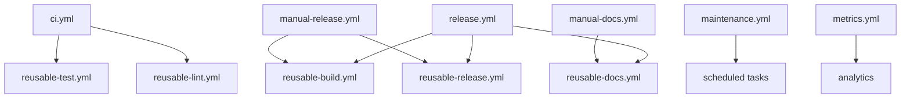

# Workflow Catalog

**Version**: 1.1.0 **Last Updated**: 2025-10-31 **Status**: Complete

## Overview

This document provides a complete catalog of all workflows in the v2 system. Each workflow is
documented with its purpose, inputs, outputs, secrets, triggers, and usage examples.

### Workflow Organization

Workflows are organized into categories:

1. **Core Workflows**: Main CI/CD workflows (ci.yml, release.yml)
2. **Reusable Workflows**: Shared workflow components (reusable-\*.yml, reusable-advanced-cache.yml)
3. **Scheduled Workflows**: Automated maintenance and analytics (maintenance.yml,
   workflow-analytics.yml)
4. **Manual Workflows**: On-demand operations (manual-release.yml)

### Workflow Naming Convention

- **ci.yml**: Continuous Integration
- **release.yml**: Release automation
- **reusable-\*.yml**: Reusable workflow components
- **manual-\*.yml**: Manual trigger workflows
- **scheduled-\*.yml**: Scheduled workflows

---

## Core Workflows

### ci.yml - Continuous Integration

**Purpose**: Main CI workflow with change detection and branch-aware testing.

**Location**: `.github/workflows/ci.yml`

**Triggers**:

```yaml
on:
  push:
    branches: [main, 'stable-*']
  pull_request:
    branches: [main, 'stable-*']
  workflow_dispatch:
```

**Inputs**:

| Name            | Type    | Required | Default | Description                         |
| --------------- | ------- | -------- | ------- | ----------------------------------- |
| force_all_tests | boolean | No       | false   | Run all tests regardless of changes |
| skip_linting    | boolean | No       | false   | Skip Super Linter step              |
| debug_mode      | boolean | No       | false   | Enable debug logging                |

**Outputs**:

| Name            | Type   | Description                                         |
| --------------- | ------ | --------------------------------------------------- |
| go_files        | string | Comma-separated list of changed Go files            |
| python_files    | string | Comma-separated list of changed Python files        |
| node_files      | string | Comma-separated list of changed Node files          |
| rust_files      | string | Comma-separated list of changed Rust files          |
| docker_files    | string | Comma-separated list of changed Docker files        |
| workflows_files | string | Comma-separated list of changed workflow files      |
| docs_files      | string | Comma-separated list of changed documentation files |
| test_matrix     | json   | Generated test matrix for all languages             |

**Secrets**:

| Name          | Required | Description                              |
| ------------- | -------- | ---------------------------------------- |
| GITHUB_TOKEN  | Yes      | Automatically provided by GitHub Actions |
| CODECOV_TOKEN | No       | Token for code coverage reporting        |

**Jobs**:

1. **detect-changes**: Detect file changes and categorize
2. **generate-matrix**: Generate test matrix based on config and changes
3. **lint**: Run Super Linter on changed files
4. **test-go**: Run Go tests (if Go files changed)
5. **test-python**: Run Python tests (if Python files changed)
6. **test-node**: Run Node tests (if Node files changed)
7. **test-rust**: Run Rust tests (if Rust files changed)
8. **build-docker**: Build Docker images (if Dockerfile changed)
9. **coverage**: Aggregate code coverage reports
10. **summary**: Generate workflow summary

**Usage Example**:

```yaml
# Automatic trigger on push
name: CI
on:
  push:
    branches: [main]

# Manual trigger with options
name: Manual CI
on:
  workflow_dispatch:
    inputs:
      force_all_tests:
        description: 'Run all tests'
        type: boolean
        default: false
```

**Environment Variables**:

```yaml
env:
  GO_VERSION: ${{ matrix.go-version }}
  PYTHON_VERSION: ${{ matrix.python-version }}
  NODE_VERSION: ${{ matrix.node-version }}
  RUST_VERSION: ${{ matrix.rust-version }}
```

**Branch-Specific Behavior**:

- **main branch**: Uses latest language versions
- **stable-1-\* branches**: Uses locked versions from workflow-versions.yml
- Respects `locked`, `end_of_life`, and `work_stopped` flags

**Performance Optimizations**:

- Change detection skips unnecessary tests
- Parallel execution of language-specific tests
- Cached dependencies per language
- Matrix generation optimizes test configurations

---

### release.yml - Release Automation

**Purpose**: Automated release creation with branch-aware version targeting.

**Location**: `.github/workflows/release.yml`

**Triggers**:

```yaml
on:
  push:
    tags:
      - 'v*'
      - 'stable-*-v*'
  workflow_dispatch:
    inputs:
      bump_type:
        description: 'Version bump type'
        required: false
        type: choice
        options: [major, minor, patch]
```

**Inputs**:

| Name       | Type    | Required | Default | Description                                |
| ---------- | ------- | -------- | ------- | ------------------------------------------ |
| bump_type  | choice  | No       | auto    | Version bump type (auto/major/minor/patch) |
| prerelease | boolean | No       | false   | Mark as prerelease                         |
| draft      | boolean | No       | false   | Create as draft release                    |
| skip_build | boolean | No       | false   | Skip asset building                        |

**Outputs**:

| Name        | Type   | Description                           |
| ----------- | ------ | ------------------------------------- |
| version     | string | Released version number (e.g., 1.2.3) |
| tag         | string | Git tag name (e.g., v1.2.3)           |
| release_url | string | GitHub release URL                    |
| asset_count | number | Number of uploaded assets             |

**Secrets**:

| Name            | Required | Description                     |
| --------------- | -------- | ------------------------------- |
| GITHUB_TOKEN    | Yes      | For creating releases and tags  |
| GPG_PRIVATE_KEY | No       | For signing release artifacts   |
| GPG_PASSPHRASE  | No       | GPG key passphrase              |
| DOCKER_USERNAME | No       | Docker Hub username             |
| DOCKER_PASSWORD | No       | Docker Hub password             |
| GHCR_TOKEN      | No       | GitHub Container Registry token |

**Jobs**:

1. **detect-version**: Detect version bump from commits
2. **validate-branch**: Validate branch policy (not locked/EOL)
3. **build-go**: Build Go binaries for all platforms
4. **build-rust**: Build Rust binaries for all platforms
5. **build-docker**: Build and push Docker images
6. **generate-notes**: Generate release notes from commits
7. **create-release**: Create GitHub release with assets
8. **publish-packages**: Publish to package registries
9. **update-docs**: Update documentation with new version

**Usage Example**:

```yaml
# Automatic trigger on tag push
git tag v1.2.3 git push origin v1.2.3
# Manual trigger
# Go to Actions → Release → Run workflow
# Select bump_type: minor
```

**Release Artifact Matrix**:

**Go Binaries**:

- `binary-linux-amd64`
- `binary-linux-arm64`
- `binary-darwin-amd64` (Intel Mac)
- `binary-darwin-arm64` (Apple Silicon)

**Rust Binaries**:

- `binary-x86_64-unknown-linux-gnu`
- `binary-aarch64-unknown-linux-gnu`
- `binary-x86_64-apple-darwin`
- `binary-aarch64-apple-darwin`

**Docker Images**:

- `ghcr.io/owner/repo:version`
- `ghcr.io/owner/repo:latest` (main branch only)
- `ghcr.io/owner/repo:stable-1` (stable branches)

**Branch-Specific Release Behavior**:

| Branch Pattern | Tag Prefix | Version Source | Registry Tags     |
| -------------- | ---------- | -------------- | ----------------- |
| main           | v          | Auto-detect    | latest, version   |
| stable-1-\*    | stable-1-v | Locked version | stable-1, version |
| stable-2-\*    | stable-2-v | Locked version | stable-2, version |

**Version Detection Logic**:

```text
1. Check commits since last tag
2. Analyze commit messages (Conventional Commits)
3. Determine bump type:
   - BREAKING CHANGE: → major
   - feat: → minor
   - fix:/chore:/docs: → patch
4. Calculate next version
5. Validate against branch policy
```

---

## Reusable Workflows

### reusable-test.yml - Test Execution

**Purpose**: Reusable workflow for running language-specific tests.

**Location**: `.github/workflows/reusable-test.yml`

**Triggers**:

```yaml
on:
  workflow_call:
    inputs:
      language:
        required: true
        type: string
      version:
        required: true
        type: string
      os:
        required: false
        type: string
        default: ubuntu-latest
```

**Inputs**:

| Name       | Type    | Required | Default       | Description                            |
| ---------- | ------- | -------- | ------------- | -------------------------------------- |
| language   | string  | Yes      | -             | Language to test (go/python/node/rust) |
| version    | string  | Yes      | -             | Language version to use                |
| os         | string  | No       | ubuntu-latest | Runner OS (ubuntu-latest/macos-latest) |
| test_flags | string  | No       | ""            | Additional test flags                  |
| coverage   | boolean | No       | true          | Collect code coverage                  |

**Outputs**:

| Name             | Type   | Description                             |
| ---------------- | ------ | --------------------------------------- |
| test_result      | string | Test execution result (success/failure) |
| coverage_percent | number | Code coverage percentage                |
| test_count       | number | Number of tests executed                |
| duration         | number | Test execution time in seconds          |

**Secrets**:

| Name          | Required | Description                |
| ------------- | -------- | -------------------------- |
| CODECOV_TOKEN | No       | Code coverage upload token |

**Usage Example**:

```yaml
name: Test Go
on: [push]

jobs:
  test:
    uses: ./.github/workflows/reusable-test.yml
    with:
      language: go
      version: '1.23'
      os: ubuntu-latest
      coverage: true
    secrets:
      CODECOV_TOKEN: ${{ secrets.CODECOV_TOKEN }}
```

**Supported Languages**:

**Go**:

```yaml
test:
  uses: ./.github/workflows/reusable-test.yml
  with:
    language: go
    version: '1.23'
    test_flags: '-race -timeout 10m'
```

**Python**:

```yaml
test:
  uses: ./.github/workflows/reusable-test.yml
  with:
    language: python
    version: '3.13'
    test_flags: '--verbose --strict-markers'
```

**Node.js**:

```yaml
test:
  uses: ./.github/workflows/reusable-test.yml
  with:
    language: node
    version: '20'
    test_flags: '--coverage'
```

**Rust**:

```yaml
test:
  uses: ./.github/workflows/reusable-test.yml
  with:
    language: rust
    version: stable
    test_flags: '--all-features'
```

---

### reusable-build.yml - Build Assets

**Purpose**: Reusable workflow for building release assets.

**Location**: `.github/workflows/reusable-build.yml`

**Triggers**:

```yaml
on:
  workflow_call:
    inputs:
      language:
        required: true
        type: string
      version:
        required: true
        type: string
```

**Inputs**:

| Name        | Type    | Required | Default | Description                    |
| ----------- | ------- | -------- | ------- | ------------------------------ |
| language    | string  | Yes      | -       | Language to build (go/rust)    |
| version     | string  | Yes      | -       | Language version               |
| output_dir  | string  | No       | dist    | Output directory for artifacts |
| strip_debug | boolean | No       | true    | Strip debug symbols            |
| compress    | boolean | No       | true    | Compress binaries with UPX     |

**Outputs**:

| Name           | Type   | Description                  |
| -------------- | ------ | ---------------------------- |
| artifacts      | string | JSON array of artifact paths |
| artifact_count | number | Number of built artifacts    |
| total_size     | number | Total size in bytes          |

**Usage Example**:

```yaml
name: Build Release
on:
  push:
    tags: ['v*']

jobs:
  build:
    uses: ./.github/workflows/reusable-build.yml
    with:
      language: go
      version: '1.23'
      compress: true
```

**Build Matrix**:

Automatically builds for:

- Linux: amd64, arm64
- macOS: amd64 (Intel), arm64 (Apple Silicon)
- NO WINDOWS

---

### reusable-lint.yml - Code Linting

**Purpose**: Reusable workflow for Super Linter integration.

**Location**: `.github/workflows/reusable-lint.yml`

**Triggers**:

```yaml
on:
  workflow_call:
    inputs:
      mode:
        required: false
        type: string
        default: ci
```

**Inputs**:

| Name          | Type    | Required | Default | Description                    |
| ------------- | ------- | -------- | ------- | ------------------------------ |
| mode          | string  | No       | ci      | Linting mode (ci/pr/strict)    |
| changed_files | string  | No       | ""      | JSON array of changed files    |
| auto_fix      | boolean | No       | false   | Auto-fix issues (PR mode only) |
| fail_on_error | boolean | No       | true    | Fail workflow on lint errors   |

**Outputs**:

| Name           | Type    | Description                    |
| -------------- | ------- | ------------------------------ |
| errors_found   | boolean | Whether lint errors were found |
| error_count    | number  | Total number of errors         |
| warnings_count | number  | Total number of warnings       |
| files_linted   | number  | Number of files linted         |

**Usage Example**:

```yaml
name: Lint
on: [pull_request]

jobs:
  lint:
    uses: ./.github/workflows/reusable-lint.yml
    with:
      mode: pr
      auto_fix: true
      fail_on_error: false
```

**Linting Modes**:

- **ci**: Strict linting, no auto-fix, fails on error
- **pr**: Lenient linting, auto-fix enabled, warnings only
- **strict**: Maximum strictness, fails on warnings

---

### reusable-docs.yml - Documentation Generation

**Purpose**: Reusable workflow for generating documentation.

**Location**: `.github/workflows/reusable-docs.yml`

**Triggers**:

```yaml
on:
  workflow_call:
    inputs:
      module_path:
        required: true
        type: string
```

**Inputs**:

| Name            | Type    | Required | Default  | Description                   |
| --------------- | ------- | -------- | -------- | ----------------------------- |
| module_path     | string  | Yes      | -        | Path to module to document    |
| output_dir      | string  | No       | docs/api | Output directory              |
| include_private | boolean | No       | false    | Include private symbols       |
| format          | string  | No       | markdown | Output format (markdown/html) |

**Outputs**:

| Name           | Type    | Description                 |
| -------------- | ------- | --------------------------- |
| docs_generated | boolean | Whether docs were generated |
| page_count     | number  | Number of pages generated   |
| output_path    | string  | Path to generated docs      |

**Usage Example**:

```yaml
name: Generate Docs
on:
  push:
    branches: [main]
    paths: ['**.go']

jobs:
  docs:
    uses: ./.github/workflows/reusable-docs.yml
    with:
      module_path: .
      output_dir: docs/api
      format: markdown
```

---

### reusable-release.yml - Release Creation

**Purpose**: Reusable workflow for creating releases.

**Location**: `.github/workflows/reusable-release.yml`

**Triggers**:

```yaml
on:
  workflow_call:
    inputs:
      tag:
        required: true
        type: string
```

**Inputs**:

| Name           | Type    | Required | Default | Description                 |
| -------------- | ------- | -------- | ------- | --------------------------- |
| tag            | string  | Yes      | -       | Release tag name            |
| draft          | boolean | No       | false   | Create as draft             |
| prerelease     | boolean | No       | false   | Mark as prerelease          |
| generate_notes | boolean | No       | true    | Auto-generate release notes |
| assets         | string  | No       | ""      | JSON array of asset paths   |

**Outputs**:

| Name        | Type   | Description       |
| ----------- | ------ | ----------------- |
| release_id  | number | GitHub release ID |
| release_url | string | Release URL       |
| upload_url  | string | Asset upload URL  |

**Secrets**:

| Name            | Required | Description          |
| --------------- | -------- | -------------------- |
| GITHUB_TOKEN    | Yes      | For creating release |
| GPG_PRIVATE_KEY | No       | For signing assets   |

**Usage Example**:

```yaml
name: Create Release
on:
  push:
    tags: ['v*']

jobs:
  release:
    uses: ./.github/workflows/reusable-release.yml
    with:
      tag: ${{ github.ref_name }}
      generate_notes: true
      assets: '["dist/binary-linux-amd64", "dist/binary-darwin-arm64"]'
    secrets:
      GITHUB_TOKEN: ${{ secrets.GITHUB_TOKEN }}
```

### reusable-advanced-cache.yml - Intelligent Dependency Caching

**Purpose**: Generate deterministic cache keys and coordinate dependency caching across ecosystems.

**Location**: `.github/workflows/reusable-advanced-cache.yml`

**Triggers**:

```yaml
on:
  workflow_call:
    inputs:
      language:
        required: true
        type: string
      cache-prefix:
        required: true
        type: string
      include-branch:
        required: false
        type: boolean
        default: false
```

**Inputs**:

| Name           | Type    | Required | Default | Description                                                            |
| -------------- | ------- | -------- | ------- | ---------------------------------------------------------------------- |
| language       | string  | Yes      | -       | Language ecosystem (go/rust/python/node) used to derive cache metadata |
| cache-prefix   | string  | Yes      | -       | Base prefix for cache keys (e.g., go-build)                            |
| include-branch | boolean | No       | false   | Append sanitized branch name for branch-scoped caches                  |

**Outputs**:

| Name      | Type    | Description                                                    |
| --------- | ------- | -------------------------------------------------------------- |
| cache-key | string  | Fully qualified cache key produced by `automation_workflow.py` |
| cache-hit | boolean | Indicates whether `actions/cache` restored an entry            |

**Secrets**: _None_

**Usage Example**:

```yaml
jobs:
  cache-go:
    uses: ./.github/workflows/reusable-advanced-cache.yml
    with:
      language: go
      cache-prefix: go-build
      include-branch: true
```

**Implementation Notes**:

- Uses `automation_workflow.py cache-plan` to emit language-specific files and directories to GitHub
  outputs.
- Uses `automation_workflow.py cache-key` to emit cache metadata (key, restore keys, paths) with
  optional branch segmentation.
- Supports Go, Rust, Python, and Node heuristics out of the box; extend `cache-plan` for additional
  ecosystems.
- Branch names are normalized to lower-case kebab form to avoid cache key collisions.

---

## Scheduled Workflows

### maintenance.yml - Automated Maintenance

**Purpose**: Scheduled maintenance tasks (dependency updates, security scans).

**Location**: `.github/workflows/maintenance.yml`

**Triggers**:

```yaml
on:
  schedule:
    - cron: '0 2 * * 1' # Every Monday at 2 AM UTC
  workflow_dispatch:
```

**Inputs** (manual trigger):

| Name               | Type    | Required | Default | Description                     |
| ------------------ | ------- | -------- | ------- | ------------------------------- |
| check_dependencies | boolean | No       | true    | Check for outdated dependencies |
| run_security_scan  | boolean | No       | true    | Run security vulnerability scan |
| update_stale       | boolean | No       | true    | Mark stale issues/PRs           |

**Jobs**:

1. **check-dependencies**: Check for outdated dependencies
2. **security-scan**: Run security vulnerability scans
3. **update-dependencies**: Create PRs for dependency updates
4. **stale-detection**: Mark stale issues and PRs
5. **cleanup**: Clean up old workflow runs and artifacts

**Usage Example**:

```yaml
# Runs automatically every Monday at 2 AM UTC

# Manual trigger
# Go to Actions → Maintenance → Run workflow
```

**Scheduled Tasks**:

| Task             | Frequency | Description                      |
| ---------------- | --------- | -------------------------------- |
| Dependency Check | Weekly    | Check for outdated dependencies  |
| Security Scan    | Weekly    | Scan for vulnerabilities         |
| Stale Detection  | Weekly    | Mark stale issues/PRs (30+ days) |
| Artifact Cleanup | Weekly    | Delete artifacts >90 days old    |

---

### metrics.yml - Workflow Metrics Collection

**Purpose**: Collect and report workflow execution metrics.

**Location**: `.github/workflows/metrics.yml`

**Triggers**:

```yaml
on:
  schedule:
    - cron: '0 0 * * *' # Daily at midnight UTC
  workflow_dispatch:
```

**Inputs** (manual trigger):

| Name          | Type    | Required | Default | Description                |
| ------------- | ------- | -------- | ------- | -------------------------- |
| lookback_days | number  | No       | 30      | Days of history to analyze |
| include_costs | boolean | No       | true    | Include estimated costs    |

**Outputs**:

| Name         | Type   | Description                 |
| ------------ | ------ | --------------------------- |
| report_url   | string | URL to generated report     |
| total_runs   | number | Total workflow runs         |
| success_rate | number | Success rate percentage     |
| avg_duration | number | Average duration in minutes |

**Jobs**:

1. **collect-metrics**: Collect workflow execution data
2. **analyze-performance**: Analyze performance trends
3. **calculate-costs**: Estimate compute costs
4. **generate-report**: Generate metrics dashboard
5. **update-wiki**: Update repository wiki with metrics

**Usage Example**:

```yaml
# Runs automatically daily at midnight UTC

# Manual trigger for specific period
# Go to Actions → Metrics → Run workflow
# Set lookback_days: 90
```

**Collected Metrics**:

- Total workflow runs
- Success/failure rates
- Average execution duration
- Most expensive workflows
- Failure patterns
- Performance trends

### workflow-analytics.yml - Workflow Insights

**Purpose**: Collect workflow run metrics, generate summaries, and surface self-healing actions.

**Location**: `.github/workflows/workflow-analytics.yml`

**Triggers**:

```yaml
on:
  workflow_dispatch:
    inputs:
      lookback-days:
        description: Number of days to analyze (default 30)
        required: false
        default: '30'
        type: string
  schedule:
    - cron: '0 3 * * 1'
```

**Inputs** (manual trigger):

| Name          | Type   | Required | Default | Description                                  |
| ------------- | ------ | -------- | ------- | -------------------------------------------- |
| lookback-days | string | No       | '30'    | Rolling window (days) for metrics collection |

**Artifacts & Outputs**:

| Name               | Type     | Description                                                  |
| ------------------ | -------- | ------------------------------------------------------------ |
| workflow-analytics | artifact | Contains `analytics-report.json` and `workflow-analytics.md` |
| step summary       | markdown | Inline summary appended to `$GITHUB_STEP_SUMMARY`            |

**Jobs**:

1. **collect**: Calls `automation_workflow.py collect-metrics` against the current repository with
   optional lookback filtering.
2. **summarize**: Generates Markdown tables highlighting top workflows and recommended actions.
3. **publish**: Uploads artifacts and updates the workflow run summary for quick visibility.

**Usage Example**:

```yaml
# Manual run with custom lookback window
workflow_dispatch:
  inputs:
    lookback-days:
      description: Analyze the last 14 days
      required: false
      default: '14'
```

**Integration Tips**:

- Grant the workflow access to `GITHUB_TOKEN` with `actions:read` and `contents:read` permissions
  (default).
- Combine with dashboards or external tooling by parsing `analytics-report.json`.
- Extend the summary step to push data into Slack or other reporting endpoints as needed.

---

## Manual Workflows

### manual-release.yml - Manual Release Trigger

**Purpose**: Manually trigger a release with custom options.

**Location**: `.github/workflows/manual-release.yml`

**Triggers**:

```yaml
on:
  workflow_dispatch:
    inputs:
      version:
        description: 'Version to release'
        required: true
        type: string
      bump_type:
        description: 'Version bump type'
        required: true
        type: choice
        options: [major, minor, patch, custom]
```

**Inputs**:

| Name           | Type    | Required    | Default | Description                          |
| -------------- | ------- | ----------- | ------- | ------------------------------------ |
| version        | string  | Conditional | -       | Custom version (if bump_type=custom) |
| bump_type      | choice  | Yes         | -       | major/minor/patch/custom             |
| branch         | string  | No          | main    | Branch to release from               |
| prerelease     | boolean | No          | false   | Mark as prerelease                   |
| draft          | boolean | No          | false   | Create as draft                      |
| include_go     | boolean | No          | true    | Build Go binaries                    |
| include_rust   | boolean | No          | true    | Build Rust binaries                  |
| include_docker | boolean | No          | true    | Build Docker images                  |

**Usage Example**:

```yaml
# Go to Actions → Manual Release → Run workflow
# Inputs:
#   version: 1.2.3
#   bump_type: minor
#   branch: main
#   include_go: true
#   include_rust: true
```

---

### manual-docs.yml - Manual Documentation Generation

**Purpose**: Manually trigger documentation generation.

**Location**: `.github/workflows/manual-docs.yml`

**Triggers**:

```yaml
on:
  workflow_dispatch:
    inputs:
      module_path:
        description: 'Module path to document'
        required: false
        type: string
        default: '.'
```

**Inputs**:

| Name            | Type    | Required | Default  | Description             |
| --------------- | ------- | -------- | -------- | ----------------------- |
| module_path     | string  | No       | .        | Path to module          |
| output_dir      | string  | No       | docs/api | Output directory        |
| include_private | boolean | No       | false    | Include private symbols |
| deploy_pages    | boolean | No       | true     | Deploy to GitHub Pages  |
| format          | choice  | No       | markdown | markdown/html/both      |

**Usage Example**:

```yaml
# Go to Actions → Manual Docs → Run workflow
# Inputs:
#   module_path: .
#   output_dir: docs/api
#   deploy_pages: true
```

---

## Workflow Dependencies

### Dependency Graph



### Workflow Call Chain

**CI Workflow**:

1. ci.yml (main)
   - → reusable-test.yml (for each language)
   - → reusable-lint.yml (Super Linter)
   - → coverage aggregation

**Release Workflow**:

1. release.yml (main)
   - → reusable-build.yml (build assets)
   - → reusable-release.yml (create release)
   - → reusable-docs.yml (update docs)
   - → package publishing

**Maintenance Workflow**:

1. maintenance.yml (scheduled)
   - → dependency checks
   - → security scans
   - → stale detection
   - → cleanup tasks

---

## Common Patterns

### Pattern 1: Branch-Aware Testing

```yaml
name: CI
on: [push, pull_request]

jobs:
  test:
    strategy:
      matrix:
        include:
          - os: ubuntu-latest
            go-version: ${{ steps.config.outputs.go-version }}
          - os: macos-latest
            go-version: ${{ steps.config.outputs.go-version }}
    steps:
      - name: Load Config
        id: config
        run: |
          VERSION=$(python3 .github/helpers/workflow_common.py get-version go)
          echo "go-version=$VERSION" >> $GITHUB_OUTPUT
```

### Pattern 2: Conditional Execution

```yaml
jobs:
  test-go:
    needs: detect-changes
    if: needs.detect-changes.outputs.go_files != ''
    runs-on: ubuntu-latest
    steps:
      - name: Run Go Tests
        run: go test ./...
```

### Pattern 3: Matrix Generation

```yaml
jobs:
  generate-matrix:
    runs-on: ubuntu-latest
    outputs:
      matrix: ${{ steps.generate.outputs.matrix }}
    steps:
      - name: Generate Test Matrix
        id: generate
        run: |
          MATRIX=$(python3 .github/helpers/ci_workflow.py generate-matrix)
          echo "matrix=$MATRIX" >> $GITHUB_OUTPUT

  test:
    needs: generate-matrix
    strategy:
      matrix: ${{ fromJSON(needs.generate-matrix.outputs.matrix) }}
    runs-on: ${{ matrix.os }}
```

### Pattern 4: Artifact Upload/Download

```yaml
jobs:
  build:
    runs-on: ubuntu-latest
    steps:
      - name: Build Binary
        run: go build -o binary

      - name: Upload Artifact
        uses: actions/upload-artifact@v4
        with:
          name: binary-${{ matrix.os }}-${{ matrix.arch }}
          path: binary

  release:
    needs: build
    runs-on: ubuntu-latest
    steps:
      - name: Download Artifacts
        uses: actions/download-artifact@v4
        with:
          pattern: binary-*
          path: dist/
```

---

## Environment Variables

### Global Environment Variables

Available in all workflows:

```yaml
env:
  # GitHub context
  GITHUB_REPOSITORY: ${{ github.repository }}
  GITHUB_REF: ${{ github.ref }}
  GITHUB_SHA: ${{ github.sha }}
  GITHUB_ACTOR: ${{ github.actor }}

  # Workflow v2 config
  WORKFLOW_CONFIG: .github/workflow-versions.yml
  WORKFLOW_V2_ENABLED: true

  # Build settings
  GOOS: linux
  GOARCH: amd64
  CGO_ENABLED: 0
```

### Language-Specific Variables

**Go**:

```yaml
env:
  GO_VERSION: ${{ matrix.go-version }}
  GOPATH: ${{ github.workspace }}/go
  GOCACHE: ${{ github.workspace }}/.cache/go-build
```

**Python**:

```yaml
env:
  PYTHON_VERSION: ${{ matrix.python-version }}
  PIP_CACHE_DIR: ${{ github.workspace }}/.cache/pip
  PYTHONUNBUFFERED: 1
```

**Node.js**:

```yaml
env:
  NODE_VERSION: ${{ matrix.node-version }}
  NPM_CONFIG_CACHE: ${{ github.workspace }}/.npm
  NODE_ENV: production
```

**Rust**:

```yaml
env:
  RUST_VERSION: ${{ matrix.rust-version }}
  CARGO_HOME: ${{ github.workspace }}/.cargo
  RUSTFLAGS: -D warnings
```

---

## Secrets Management

### Required Secrets

**For All Workflows**:

- `GITHUB_TOKEN`: Automatically provided by GitHub Actions

**For Release Workflows**:

- `GPG_PRIVATE_KEY`: For signing release artifacts
- `GPG_PASSPHRASE`: GPG key passphrase

**For Docker Publishing**:

- `DOCKER_USERNAME`: Docker Hub username
- `DOCKER_PASSWORD`: Docker Hub password/token
- `GHCR_TOKEN`: GitHub Container Registry token

**For Package Publishing**:

- `NPM_TOKEN`: npm registry token
- `PYPI_TOKEN`: PyPI publishing token
- `CRATES_IO_TOKEN`: Crates.io publishing token

**For Code Coverage**:

- `CODECOV_TOKEN`: Codecov upload token

### Secret Usage Example

```yaml
jobs:
  release:
    runs-on: ubuntu-latest
    steps:
      - name: Sign Artifacts
        env:
          GPG_PRIVATE_KEY: ${{ secrets.GPG_PRIVATE_KEY }}
          GPG_PASSPHRASE: ${{ secrets.GPG_PASSPHRASE }}
        run: |
          echo "$GPG_PRIVATE_KEY" | gpg --import
          gpg --batch --yes --passphrase "$GPG_PASSPHRASE" \
              --detach-sign binary
```

---

## Performance Optimization

### Caching Strategy

**Dependencies**:

```yaml
- name: Cache Dependencies
  uses: actions/cache@v4
  with:
    path: |
      ~/.cache/go-build
      ~/go/pkg/mod
    key: ${{ runner.os }}-go-${{ hashFiles('**/go.sum') }}
    restore-keys: |
      ${{ runner.os }}-go-
```

**Build Artifacts**:

```yaml
- name: Cache Build
  uses: actions/cache@v4
  with:
    path: dist/
    key: ${{ runner.os }}-build-${{ github.sha }}
```

### Parallel Execution

```yaml
jobs:
  test:
    strategy:
      matrix:
        language: [go, python, node, rust]
      max-parallel: 4
    runs-on: ubuntu-latest
```

### Conditional Steps

```yaml
- name: Run Expensive Operation
  if: github.event_name == 'push' && github.ref == 'refs/heads/main'
  run: ./expensive-operation.sh
```

---

## Troubleshooting

### Common Issues

**Issue**: Workflow not triggering

- **Cause**: Invalid trigger configuration
- **Fix**: Verify `on:` section matches expected events

**Issue**: Matrix generation fails

- **Cause**: Invalid workflow-versions.yml
- **Fix**: Validate config with schema

**Issue**: Reusable workflow not found

- **Cause**: Incorrect path or missing workflow
- **Fix**: Use relative path: `./.github/workflows/reusable-*.yml`

**Issue**: Secrets not available

- **Cause**: Secrets not passed to reusable workflow
- **Fix**: Add `secrets: inherit` or explicit secret passing

### Debug Mode

Enable debug logging:

```yaml
jobs:
  test:
    runs-on: ubuntu-latest
    steps:
      - name: Enable Debug
        run: echo "ACTIONS_STEP_DEBUG=true" >> $GITHUB_ENV
```

Or set repository variable:

- Settings → Secrets and variables → Actions → Variables
- Add `ACTIONS_STEP_DEBUG` = `true`

---

## Migration Guide

### Migrating from v1 to v2

**Step 1**: Add workflow-versions.yml

```yaml
version: '1.0.0'
use_workflow_v2: true

versions:
  go:
    main: '1.23'
  python:
    main: '3.13'
```

**Step 2**: Update workflow triggers

```yaml
# Before (v1)
on: [push, pull_request]

# After (v2)
on:
  push:
    branches: [main, 'stable-*']
  pull_request:
    branches: [main, 'stable-*']
```

**Step 3**: Add helper scripts

```bash
mkdir -p .github/helpers
cp workflow_common.py .github/helpers/
cp ci_workflow.py .github/helpers/
```

**Step 4**: Update job configuration

```yaml
# Before (v1)
jobs:
  test:
    runs-on: ubuntu-latest
    steps:
      - uses: actions/setup-go@v5
        with:
          go-version: '1.23'

# After (v2)
jobs:
  load-config:
    runs-on: ubuntu-latest
    outputs:
      go-version: ${{ steps.config.outputs.go-version }}
    steps:
      - id: config
        run: |
          VERSION=$(python3 .github/helpers/workflow_common.py get-version go)
          echo "go-version=$VERSION" >> $GITHUB_OUTPUT

  test:
    needs: load-config
    runs-on: ubuntu-latest
    steps:
      - uses: actions/setup-go@v5
        with:
          go-version: ${{ needs.load-config.outputs.go-version }}
```

---

## Best Practices

### Workflow Design

1. **Use reusable workflows**: Don't duplicate logic
2. **Enable caching**: Cache dependencies and build artifacts
3. **Parallelize jobs**: Run independent jobs concurrently
4. **Use change detection**: Skip unnecessary work
5. **Set timeouts**: Prevent runaway workflows

### Security

1. **Minimize secret exposure**: Only pass needed secrets
2. **Use least privilege**: Limit GITHUB_TOKEN permissions
3. **Pin action versions**: Use commit SHA for security
4. **Validate inputs**: Always validate workflow inputs
5. **Audit workflow runs**: Regularly review execution logs

### Maintenance

1. **Keep workflows DRY**: Use reusable workflows
2. **Document inputs/outputs**: Clear documentation
3. **Version workflows**: Track changes in CHANGELOG
4. **Test changes**: Validate workflow changes in PRs
5. **Monitor metrics**: Track execution time and costs

---

## Related Documentation

- [Configuration Schema](config-schema.md)
- [Helper Scripts API](helper-scripts-api.md)
- [CI Workflows Implementation](../implementation/ci-workflows.md)
- [Release Workflows Implementation](../implementation/release-workflows.md)
- [Migration Guide](../operations/migration-guide.md)
- [Troubleshooting Guide](../operations/troubleshooting.md)

---

**Document Version**: 1.1.0 **Last Review**: 2025-10-31 **Next Review**: 2025-11-30
