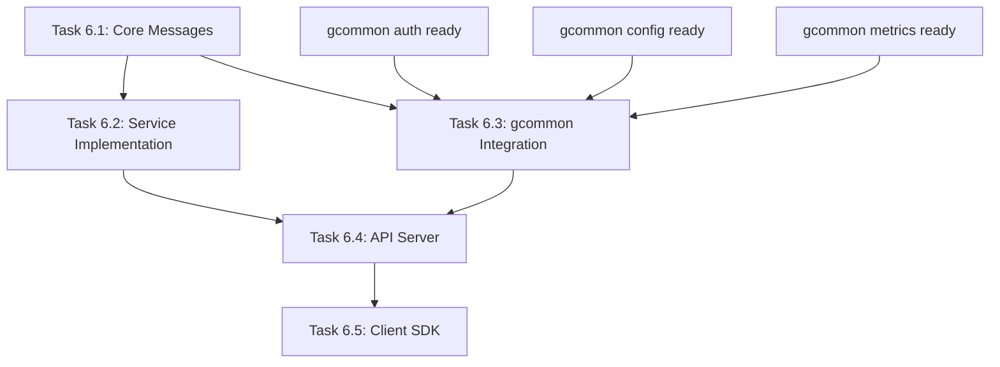

# Task 6: Subtitle Manager Protobuf Implementation Plan

<!-- file: tasks/06-subtitle-manager-implementation.md -->
<!-- version: 1.0.0 -->
<!-- guid: 56789012-5678-5678-5678-567890123ef0 -->

## Overview

Complete protobuf implementation for subtitle-manager repository, integrating with gcommon shared definitions and implementing all required services and messages.

## Critical Instructions

**NEVER edit README.md, CHANGELOG.md, TODO.md or other documentation files directly. ALWAYS use:**

- `scripts/create-doc-update.sh` for documentation updates
- `scripts/create-issue-update.sh` for issue updates
- This prevents merge conflicts between multiple AI agents

**ALWAYS follow the VS Code task priority:**

1. Use VS Code tasks first (via `run_task` tool)
2. Use `copilot-agent-util` / `copilot-agent-utilr`
3. Manual terminal commands only as last resort

## Copilot Agent Utility

Download and install from: <https://github.com/jdfalk/copilot-agent-util-rust>

Or build from source in `tools/copilot-agent-util-rust/`:

```bash
cd tools/copilot-agent-util-rust
cargo build --release
cp target/release/copilot-agent-util /usr/local/bin/
```

## Current Subtitle Manager Analysis

### Existing Structure

```bash
# Analyze current subtitle-manager structure
copilot-agent-util exec "find /path/to/subtitle-manager -type f -name '*.go' | head -20"
copilot-agent-util exec "find /path/to/subtitle-manager -type f -name '*.proto'"
copilot-agent-util exec "cat /path/to/subtitle-manager/go.mod"
```

### Current Issues

Based on analysis, subtitle-manager needs:

1. **Core Subtitle Messages**
   - Subtitle file metadata
   - Timing information
   - Text content and formatting
   - Language and encoding data

2. **Subtitle Services**
   - Subtitle parsing service
   - Validation service
   - Conversion service
   - Synchronization service

3. **Integration Services**
   - File management using gcommon
   - Authentication using gcommon auth
   - Configuration using gcommon config
   - Metrics using gcommon metrics

## Required Protobuf Definitions

### 1. Core Subtitle Messages

**File:** `pkg/subtitle/proto/subtitle.proto`

```protobuf
// file: pkg/subtitle/proto/subtitle.proto
// version: 1.0.0
// guid: 67890123-6789-6789-6789-678901234f01

edition = "2023";

package subtitle.v1;

import "google/protobuf/timestamp.proto";
import "google/protobuf/duration.proto";
import "github.com/jdfalk/gcommon/pkg/common/proto/common.proto";

// Subtitle file metadata
message SubtitleFile {
  string id = 1;
  string filename = 2;
  SubtitleFormat format = 3;
  string language_code = 4;
  string encoding = 5;
  google.protobuf.Timestamp created_at = 6;
  google.protobuf.Timestamp updated_at = 7;
  int64 file_size = 8;
  string checksum = 9;
}

// Subtitle timing entry
message SubtitleEntry {
  int32 sequence = 1;
  google.protobuf.Duration start_time = 2;
  google.protobuf.Duration end_time = 3;
  repeated string text_lines = 4;
  SubtitleStyle style = 5;
}

// Subtitle format types
enum SubtitleFormat {
  SUBTITLE_FORMAT_UNSPECIFIED = 0;
  SUBTITLE_FORMAT_SRT = 1;
  SUBTITLE_FORMAT_VTT = 2;
  SUBTITLE_FORMAT_ASS = 3;
  SUBTITLE_FORMAT_SSA = 4;
  SUBTITLE_FORMAT_TTML = 5;
}

// Subtitle styling information
message SubtitleStyle {
  string font_name = 1;
  int32 font_size = 2;
  string color = 3;
  bool bold = 4;
  bool italic = 5;
  bool underline = 6;
  string position = 7;
}
```

### 2. Subtitle Service Definitions

**File:** `pkg/subtitle/proto/subtitle_service.proto`

```protobuf
// file: pkg/subtitle/proto/subtitle_service.proto
// version: 1.0.0
// guid: 78901234-7890-7890-7890-789012345012

edition = "2023";

package subtitle.v1;

import "pkg/subtitle/proto/subtitle.proto";
import "google/protobuf/empty.proto";

// Subtitle parsing and management service
service SubtitleService {
  // Parse subtitle file
  rpc ParseSubtitle(ParseSubtitleRequest) returns (ParseSubtitleResponse);

  // Validate subtitle content
  rpc ValidateSubtitle(ValidateSubtitleRequest) returns (ValidateSubtitleResponse);

  // Convert between subtitle formats
  rpc ConvertSubtitle(ConvertSubtitleRequest) returns (ConvertSubtitleResponse);

  // Synchronize subtitle timing
  rpc SynchronizeSubtitle(SynchronizeSubtitleRequest) returns (SynchronizeSubtitleResponse);

  // Get subtitle metadata
  rpc GetSubtitleMetadata(GetSubtitleMetadataRequest) returns (GetSubtitleMetadataResponse);
}

// Parse subtitle file request
message ParseSubtitleRequest {
  bytes file_content = 1;
  SubtitleFormat format = 2;
  string encoding = 3;
}

// Parse subtitle file response
message ParseSubtitleResponse {
  SubtitleFile metadata = 1;
  repeated SubtitleEntry entries = 2;
  repeated string warnings = 3;
}

// Validate subtitle request
message ValidateSubtitleRequest {
  SubtitleFile metadata = 1;
  repeated SubtitleEntry entries = 2;
}

// Validate subtitle response
message ValidateSubtitleResponse {
  bool is_valid = 1;
  repeated ValidationError errors = 2;
  repeated string warnings = 3;
}

// Validation error details
message ValidationError {
  int32 entry_sequence = 1;
  string field = 2;
  string message = 3;
  ValidationSeverity severity = 4;
}

enum ValidationSeverity {
  VALIDATION_SEVERITY_UNSPECIFIED = 0;
  VALIDATION_SEVERITY_INFO = 1;
  VALIDATION_SEVERITY_WARNING = 2;
  VALIDATION_SEVERITY_ERROR = 3;
}

// Convert subtitle format request
message ConvertSubtitleRequest {
  SubtitleFile source_metadata = 1;
  repeated SubtitleEntry entries = 2;
  SubtitleFormat target_format = 3;
  ConversionOptions options = 4;
}

// Convert subtitle format response
message ConvertSubtitleResponse {
  bytes converted_content = 1;
  SubtitleFile target_metadata = 2;
  repeated string warnings = 3;
}

// Conversion options
message ConversionOptions {
  bool preserve_styling = 1;
  bool merge_duplicate_entries = 2;
  google.protobuf.Duration timing_offset = 3;
  float speed_adjustment = 4;
}

// Synchronize subtitle timing request
message SynchronizeSubtitleRequest {
  repeated SubtitleEntry entries = 1;
  SynchronizationOptions options = 2;
}

// Synchronize subtitle timing response
message SynchronizeSubtitleResponse {
  repeated SubtitleEntry synchronized_entries = 1;
  SynchronizationStats stats = 2;
}

// Synchronization options
message SynchronizationOptions {
  google.protobuf.Duration global_offset = 1;
  float speed_ratio = 2;
  bool auto_detect_timing = 3;
  repeated TimingPoint reference_points = 4;
}

// Timing synchronization point
message TimingPoint {
  google.protobuf.Duration original_time = 1;
  google.protobuf.Duration target_time = 2;
  string description = 3;
}

// Synchronization statistics
message SynchronizationStats {
  int32 entries_processed = 1;
  int32 entries_modified = 2;
  google.protobuf.Duration average_offset = 3;
  google.protobuf.Duration max_offset = 4;
}

// Get subtitle metadata request
message GetSubtitleMetadataRequest {
  string subtitle_id = 1;
}

// Get subtitle metadata response
message GetSubtitleMetadataResponse {
  SubtitleFile metadata = 1;
  SubtitleStats stats = 2;
}

// Subtitle statistics
message SubtitleStats {
  int32 total_entries = 1;
  google.protobuf.Duration total_duration = 2;
  google.protobuf.Duration average_display_time = 3;
  int32 words_per_minute = 4;
  repeated string languages_detected = 5;
}
```

## Implementation Tasks

### Task 6.1: Core Message Implementation

**Priority:** HIGH
**Dependencies:** gcommon common types

**Steps:**

1. **Create Proto Files**

```bash
# Create subtitle proto definitions
copilot-agent-util exec "mkdir -p pkg/subtitle/proto"
# Create files as defined above
```

2. **Configure Generation**

```bash
# Update buf.gen.yaml
copilot-agent-util exec "cat buf.gen.yaml"
# Ensure Go generation is configured
```

3. **Generate Code**

```bash
# Generate protobuf code
copilot-agent-util buf generate
```

**Deliverables:**

- [ ] `pkg/subtitle/proto/subtitle.proto` created
- [ ] `pkg/subtitle/proto/subtitle_service.proto` created
- [ ] Generated Go code in `pkg/subtitle/proto/`
- [ ] buf.yaml configured correctly
- [ ] buf.gen.yaml includes subtitle package

### Task 6.2: Service Implementation

**Priority:** HIGH
**Dependencies:** Task 6.1, gcommon auth

**Steps:**

1. **Implement Subtitle Service**

```go
// file: pkg/subtitle/service/subtitle_service.go
// version: 1.0.0
// guid: 89012345-8901-8901-8901-890123456123

package service

import (
    "context"

    subtitlepb "github.com/jdfalk/subtitle-manager/pkg/subtitle/proto"
    authpb "github.com/jdfalk/gcommon/pkg/auth/proto"
)

type SubtitleService struct {
    subtitlepb.UnimplementedSubtitleServiceServer
    authClient authpb.AuthorizationServiceClient
}

func (s *SubtitleService) ParseSubtitle(ctx context.Context, req *subtitlepb.ParseSubtitleRequest) (*subtitlepb.ParseSubtitleResponse, error) {
    // Implementation
    return nil, nil
}
```

2. **Implement Subtitle Parser**

```bash
# Create parser implementations
copilot-agent-util exec "mkdir -p pkg/subtitle/parser"
```

3. **Add Unit Tests**

```bash
# Create test files
copilot-agent-util exec "mkdir -p pkg/subtitle/service/test"
```

**Deliverables:**

- [ ] `SubtitleService` implementation
- [ ] Subtitle format parsers (SRT, VTT, ASS, etc.)
- [ ] Validation logic implementation
- [ ] Conversion logic implementation
- [ ] Synchronization algorithms
- [ ] Comprehensive unit tests
- [ ] Integration tests

### Task 6.3: gcommon Integration

**Priority:** MEDIUM
**Dependencies:** gcommon modules, Task 6.2

**Steps:**

1. **Update Dependencies**

```bash
# Update go.mod to include gcommon
copilot-agent-util exec "go mod edit -require github.com/jdfalk/gcommon@latest"
copilot-agent-util exec "go mod tidy"
```

2. **Integrate Authentication**

```go
// Use gcommon auth service
import authpb "github.com/jdfalk/gcommon/pkg/auth/proto"

func (s *SubtitleService) authenticateRequest(ctx context.Context) error {
    // Use gcommon auth
}
```

3. **Integrate Configuration**

```go
// Use gcommon config
import configpb "github.com/jdfalk/gcommon/pkg/config/proto"
```

4. **Add Metrics**

```go
// Use gcommon metrics
import metricspb "github.com/jdfalk/gcommon/pkg/metrics/proto"
```

**Deliverables:**

- [ ] Updated `go.mod` with gcommon dependency
- [ ] Authentication integration
- [ ] Configuration management integration
- [ ] Metrics collection integration
- [ ] Error handling using gcommon patterns
- [ ] Logging using gcommon standards

### Task 6.4: API Server Implementation

**Priority:** MEDIUM
**Dependencies:** Task 6.2, Task 6.3

**Steps:**

1. **Create gRPC Server**

```go
// file: cmd/subtitle-server/main.go
// version: 1.0.0
// guid: 90123456-9012-9012-9012-901234567234

package main

import (
    "google.golang.org/grpc"
    subtitlepb "github.com/jdfalk/subtitle-manager/pkg/subtitle/proto"
)

func main() {
    // Initialize gRPC server with subtitle service
}
```

2. **Add HTTP Gateway**

```bash
# Configure grpc-gateway for REST API
copilot-agent-util exec "go get github.com/grpc-ecosystem/grpc-gateway/v2"
```

3. **Add Health Checks**

```go
// Implement health check service
import "google.golang.org/grpc/health/grpc_health_v1"
```

**Deliverables:**

- [ ] gRPC server implementation
- [ ] HTTP/REST gateway
- [ ] Health check endpoints
- [ ] Graceful shutdown handling
- [ ] Configuration management
- [ ] Docker containerization
- [ ] Deployment manifests

### Task 6.5: Client SDK Generation

**Priority:** LOW
**Dependencies:** Task 6.1, Task 6.4

**Steps:**

1. **Generate Go Client**

```bash
# Generate client code
copilot-agent-util buf generate --template buf.gen.client.yaml
```

2. **Create Client Library**

```go
// file: pkg/subtitle/client/client.go
// version: 1.0.0
// guid: 01234567-0123-0123-0123-012345678345

package client

import (
    "google.golang.org/grpc"
    subtitlepb "github.com/jdfalk/subtitle-manager/pkg/subtitle/proto"
)

type Client struct {
    conn   *grpc.ClientConn
    client subtitlepb.SubtitleServiceClient
}

func NewClient(endpoint string) (*Client, error) {
    // Implementation
}
```

3. **Add Examples**

```bash
# Create example usage
copilot-agent-util exec "mkdir -p examples/subtitle-client"
```

**Deliverables:**

- [ ] Go client library
- [ ] Client configuration options
- [ ] Connection management
- [ ] Error handling
- [ ] Usage examples
- [ ] Client documentation
- [ ] Integration tests

## Integration Testing Strategy

### Test Scenarios

1. **End-to-End Subtitle Processing**

```bash
# Test complete subtitle workflow
copilot-agent-util exec "go test ./test/e2e/..."
```

2. **gcommon Integration Tests**

```bash
# Test gcommon service integration
copilot-agent-util exec "go test ./test/integration/..."
```

3. **Performance Tests**

```bash
# Test subtitle processing performance
copilot-agent-util exec "go test -bench=. ./test/performance/..."
```

**Test Coverage Requirements:**

- [ ] Unit tests: >90% coverage
- [ ] Integration tests: All service interactions
- [ ] E2E tests: Complete workflows
- [ ] Performance tests: Processing benchmarks
- [ ] Load tests: Concurrent request handling

## Documentation Requirements

### API Documentation

1. **Protocol Documentation**

```bash
# Generate protobuf documentation
copilot-agent-util exec "buf generate --template buf.gen.docs.yaml"
```

2. **Service Documentation**

Using doc update system:

```bash
# Update README with service info
./scripts/create-doc-update.sh README.md "## Subtitle Service API" append
```

### Usage Guides

1. **Quick Start Guide**
2. **API Reference**
3. **Client SDK Guide**
4. **Deployment Guide**
5. **Troubleshooting Guide**

## Success Criteria

- [ ] All protobuf definitions compile without errors
- [ ] Complete service implementation with all methods
- [ ] Full integration with gcommon modules
- [ ] Working gRPC and HTTP APIs
- [ ] Client SDK with examples
- [ ] Comprehensive test coverage
- [ ] Complete documentation
- [ ] Docker deployment ready
- [ ] Performance benchmarks met
- [ ] Security audit passed

## Timeline and Dependencies



**Estimated Timeline:**

- Task 6.1: 2-3 days
- Task 6.2: 5-7 days
- Task 6.3: 3-4 days
- Task 6.4: 4-5 days
- Task 6.5: 2-3 days

**Total: 16-22 days**
